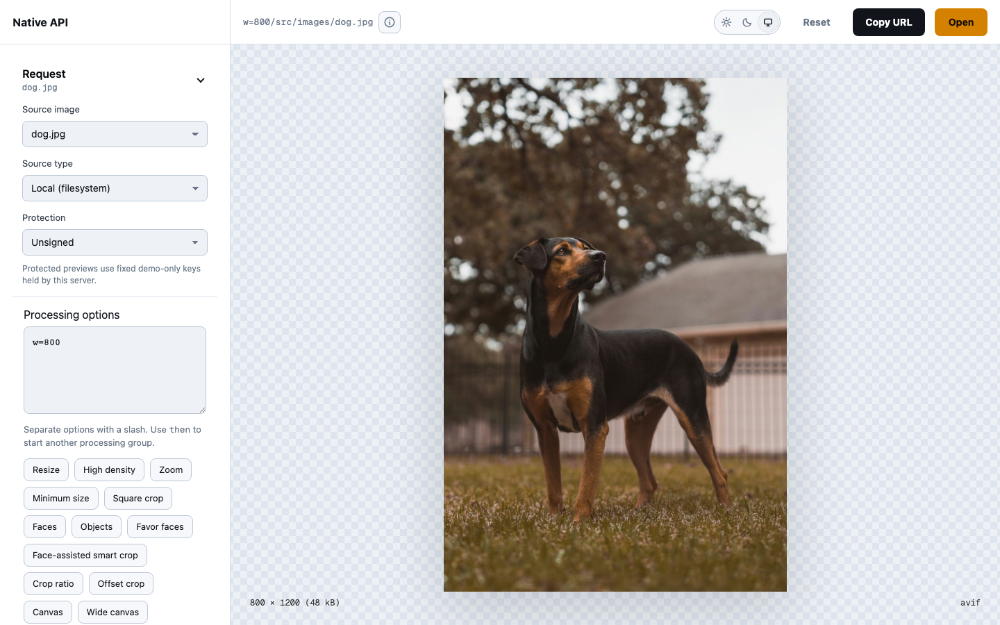

# ImagePipe

ImagePipe is a Plug-based image optimization server with a path API.
It resolves a configured image source, executes the requested transforms,
negotiates the output format, and sends the encoded image response.

## Project status

ImagePipe is unreleased and has no Hex package yet. The `0.1.0` API may change
before release.

## Installation

For local evaluation, depend on a checkout:

```elixir
def deps do
  [
    {:image_pipe, path: "../image_pipe"}
  ]
end
```

## Minimal mount

Mount ImagePipe from a Plug router or Phoenix endpoint with a configured
source adapter:

```elixir
forward "/images",
  to: ImagePipe.Plug,
  init_opts: [
    sources: [
      path: {ImagePipe.Source.File, root: "/srv/images", root_id: "primary"}
    ]
  ]
```

For a local Plug server that reads files from `priv/static/images`, point the
path source adapter at `priv/static`:

```elixir
defmodule MyApp.ImageRouter do
  use Plug.Router

  plug :match
  plug :dispatch

  forward "/",
    to: ImagePipe.Plug,
    init_opts: [
      sources: [
        path: {ImagePipe.Source.File, root: "priv/static", root_id: "static"}
      ]
    ]
end
```

With that router running at `http://localhost:4000`, this unsigned development
URL requests a 300-pixel-wide image from `/images/beach.jpg`:

```text
http://localhost:4000/w=300/src/images/beach.jpg
```

To accept both HTTP and HTTPS source URLs, configure the shared `:url` source
adapter:

```elixir
sources: [
  url: {ImagePipe.Source.HTTP, allowed_hosts: ["assets.example.com"]}
]
```

Use `:http` or `:https` instead to enable only one scheme, or when the schemes
need different adapter options.

By default, HTTP/HTTPS sources refuse to connect to non-public addresses and
re-check the policy on every redirect hop. See
[Source network policy](docs/source-network-policy.md) to allow private origins.

Configure `keys: [hex_encoded_key]` to require signed URLs. The
`sig=<mac>` segment authenticates the complete mount-relative request path
after the signature segment. Key lists support rotation: the first key signs,
and all configured keys can verify. Unsigned requests are accepted when no
keys are configured.

S3 sources use `s3://bucket/key?revision` and a configured `:s3` adapter.
Custom `source_schemes` map source names to host translators. To conceal the
source, set `encrypt_source: true` and separate `source_encryption_keys` in
`ImagePipe.config/1`, then build a signed `enc/<token>` URL with
`ImagePipe.url!/2`. Encryption is deterministic by default; choose random IVs
in configuration or override the IV per call.
See the [source contract](docs/api_contract.md#sources) for encoding,
key rotation, and a complete concealment example.

## Elixir API

Use the builder API to create a reusable processing plan with typed Elixir options:

```elixir
alias ImagePipe, as: IP

config = IP.config(base_url: "/images")
plan =
  IP.new(config)
  |> IP.group(resize: [width: 400, height: 300, fit: :cover], anchor: :smart)
  |> IP.output(format: :webp, quality: 82)

:ok = IP.validate(plan)
{:ok, result} = IP.run(plan, {:file, "photos/original.jpg"})
File.write!("thumbnail.webp", result.data)

url = IP.url!(plan, "photos/original.jpg")
```

Use `config = IP.config(...)` with `IP.new(config)` and
`plug ImagePipe.Plug, config: config` to share sources, processing defaults,
caches, and signing/encryption settings. Configured source inputs reuse the
same cache entries across Elixir and HTTP calls. Raw file and binary inputs
remain uncached.

The [Elixir API guide](docs/elixir-api.md) covers shared configuration, the
builder API, composition, direct execution, request inputs, URL generation,
results, and validation.

The API supports orientation, resize and crop, object and face detection,
pixel effects, canvas and padding, color profiles, HDR, and encoder controls.
Responses can be images, BlurHash text, LQIP CSS values, or source-info JSON.
Sources can be local paths, HTTP(S) URLs, S3 objects, or configured schemes.

Invalid requests fail before cache lookup or source fetch. The
[API contract](docs/api_contract.md) lists every option and defines
processing order, coordinate frames, and output behavior.

Use `/output=lqip-css/src/images/photo.jpg` to get a packed `#rrggbbaa`
placeholder value. Apply it as `style="--lqip: #22333091"` with the shared
stylesheet from [Image's LQIP CSS guide](https://hexdocs.pm/image/lqip_css.html).
Requested transforms shape the placeholder just like image output.

EXIF orientation applies once by default. Use `orient=none` to keep the stored
pixel orientation; user rotation and flips still apply. Trim runs after
orientation, rotation, and flips, so its automatic background comes from the
displayed top-left corner.

Use `dpr=2` for twice the output density and `zoom=1.5` (or `zoom=2,1`)
to scale resize targets. Padding follows DPR; source crops keep their physical
pixel coordinates. `min-w` and `min-h` raise the resize target's minimum size.
Without `enlarge`, source dimensions cap the resize and padding scales down
proportionally. Each `then` group starts with DPR and zoom of 1.

Configure reusable presets with option strings:

```elixir
plug ImagePipe.Plug,
  sources: [...],
  presets: %{
    "card" => "w=400/h=400/fit=cover",
    "framed" => "preset=card/then/pad=20/bg=fff/format=webp"
  }
```

`/preset=framed/src/images/photo.jpg` expands before request validation.
Preset names use letters, digits, dots, underscores, and hyphens. Nested
references compile at initialization; invalid names, unknown references, and
cycles fail there. Precedence is `default`, named presets in listed order, then explicit
URL options. Single-group presets contribute to the first group. A pipeline
preset supplies the complete sequence and allows request-wide overrides
such as `format=png`, but rejects explicit group options or another pipeline
preset. Presets share cache identity with equivalent explicit requests.

Overrides replace related alternatives: an explicit `anchor`, `focus`, or
`detect` replaces the inherited guide, and `region` replaces an inherited
`crop` together with its ratio settings. Changing a guide also resets its inherited offset. Canvas
mode, anchor, and offset form one override family: supply the desired canvas
settings together. `extend=false` or `extend-ratio=false` disables an inherited
canvas and clears its placement settings. Conflicting alternatives written
together in one preset or the explicit URL are still rejected.

Options within a group have a fixed processing order. Use `then` for a second
pass, for example `/w=500/then/trim=fff/src/images/beach.jpg` to trim after
resizing.

Use `/output=info/src/images/photo.jpg` for source format, MIME type, display
dimensions, EXIF orientation, and available byte size as JSON. Info rejects image
processing options, including options inherited from presets. It retains source
safety limits and uses a fixed content type, independent of `Accept`.

Add `filename=photo/attachment` to download an image or text response. Filenames
are stems; ImagePipe adds the response format's extension. Use letters, digits,
dots, underscores, and hyphens for `filename` and `cb` values. `attachment=false`
overrides an inherited attachment setting. Delivery settings preserve the cached
body and ETag. `cb=revision-2` changes the storage key while preserving the ETag
for unchanged bytes. The [delivery contract](docs/api_contract.md#request-delivery-controls)
also covers expiry and the optional host clock.

Use `detect=face`, `detect=car,dog`, or `detect=all,face:3` with a crop or
cover resize to select subjects. `anchor=smart-face` blends face detection
with attention. The [content-aware cropping guide](docs/content-aware-gravity.md)
covers optional detector setup, weights, fallback, and strict availability checks.

## Documentation

- [API contract](docs/api_contract.md): options and semantics.
- [Content-aware cropping](docs/content-aware-gravity.md): detection setup,
  weights, fallback, warmup, and custom detectors.
- [Cache](docs/cache.md): independent input/output pools, origin freshness, stale-while-revalidate, and failure handling.
- [CDN HTTP caching](docs/cdn-http-cache.md): `Cache-Control`, ETags,
  `Vary: Accept`, and source stability.
- [Operational notes](docs/operational_notes.md): request safety, fetching,
  decode planning, groups, and format negotiation.
- [Telemetry](docs/telemetry.md): events, measurements, metadata, and handlers.
- [Transform operations](docs/transform_operations.md): geometry, orientation,
  operations, and materialization.
- [Execution flow](docs/execution_flow.md): the request lifecycle.
- [Source network policy](docs/source-network-policy.md): SSRF protection,
  private origins, DNS resolution, and the DNS-rebinding limitation.

## Demo

The interactive demo (ImagePipe Fiddle) is a standalone Phoenix app in `fiddle/`.
The repository toolchain uses Elixir 1.20.4, OTP 29.1, Node.js 26.9.0, and pnpm 12.4.2
through `mise.toml`. Install it with `mise install` before setup. The library and
Fiddle require Elixir 1.18 or newer; CI also covers Elixir 1.18 and 1.19.

```sh
mise run setup       # installs library + fiddle deps
mise run fiddle      # boots Phoenix (:4000) + Vite (:5173)
```

Open http://localhost:4000. The processing endpoint is `/image`.
Visual controls cover resize, crop, focal points,
effects, canvas, padding, orientation, and output settings. Saved URLs
populate the controls, including a group selector for `then` requests. Examples
and an optional advanced path editor cover the full vocabulary.
The source selector exercises local files, S3, and the demo's HTTP source.
The Protection control demonstrates signed URLs and concealed sources using
fixed demo keys.



### Tracing (OpenTelemetry → Jaeger)

To export `image_pipe.*` spans to local Jaeger (see
[the cookbook](docs/cookbook/opentelemetry-jaeger.md)):

```sh
mise run fiddle:sidecars jaeger   # start Jaeger (OTLP + UI) via fiddle/docker-compose.yml
mise run fiddle otel              # boots the dev server with tracing on (FIDDLE_OTEL=1)
```

Issue a `/image` request, then open the Jaeger UI at http://localhost:16686 and
look for the `image_pipe.request` trace under the `image_pipe_fiddle` service.
Tracing is off by default; `mise run fiddle` needs no Jaeger.

### Source types (local / S3 / HTTP)

The **Source type** control selects local files, a fake S3 server, or HTTP.
All three serve the same bytes from `priv/static/images` for adapter comparisons.

S3 requires the s3proxy sidecar, which serves `priv/static/images`:

```sh
mise run fiddle:sidecars s3proxy   # fake S3 at http://localhost:8081, bucket "sources"
```

`mise run fiddle:sidecars` starts both s3proxy and Jaeger.
HTTP needs no sidecar: it fetches `http://localhost:4000/images/<file>` from
the Fiddle's `Plug.Static`.
