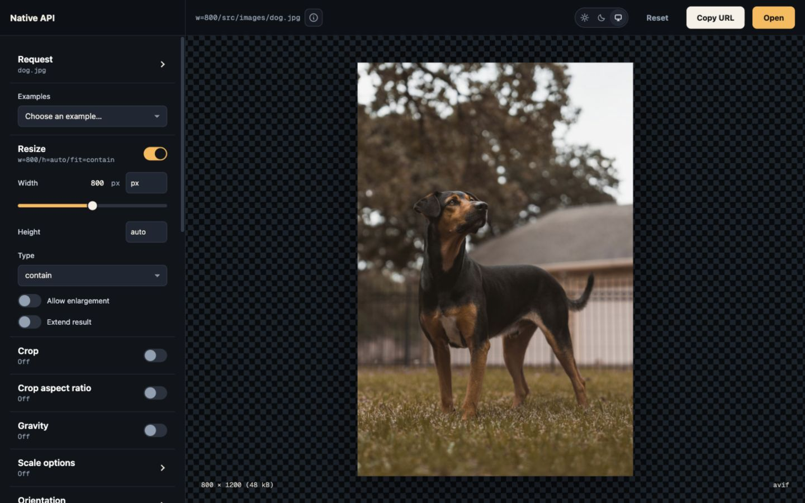

# Running the Fiddle

The interactive demo (ImagePipe Fiddle) is a standalone Phoenix app in `fiddle/`.
Install the toolchain pinned in `mise.toml`, then start the demo:

```sh
mise install
mise run setup       # installs dependencies
mise run fiddle      # boots Phoenix (:4000) + Vite (:5173)
```

Open http://localhost:4000. The processing endpoint is `/image`.
Visual controls cover resize, crop, focal points,
effects, canvas, padding, orientation, and output settings. Saved URLs
populate the controls, including a group selector for `-` requests. Examples
and an optional advanced path editor cover the full vocabulary.
The source selector exercises local files, S3, and the demo's HTTP source.
The Protection control demonstrates signed URLs and concealed sources using
fixed demo keys.



## Tracing (OpenTelemetry → Jaeger)

To export `image_pipe.*` spans to local Jaeger (see
[the cookbook](../../image_pipe/docs/cookbook/opentelemetry-jaeger.md)):

```sh
mise run fiddle:sidecars jaeger   # start Jaeger (OTLP + UI) via fiddle/docker-compose.yml
mise run fiddle otel              # boots the dev server with tracing on (FIDDLE_OTEL=1)
```

Issue a `/image` request, then open the Jaeger UI at http://localhost:16686 and
look for the `image_pipe.request` trace under the `image_pipe_fiddle` service.
Tracing is off by default, so `mise run fiddle` needs no Jaeger.

## Debug headers

The `/image` mount allows [debug headers](../../image_pipe/docs/debug_headers.md).
The **Debug headers** example adds `debug` to the request, and the panel below
the preview shows the returned facts with the output size and compression
ratio.

## Source types (local / S3 / HTTP)

The **Source type** control selects local files, a fake S3 server, or HTTP.
All three serve the same bytes from `priv/static/images` for adapter comparisons.

S3 requires the s3proxy sidecar, which serves `priv/static/images`:

```sh
mise run fiddle:sidecars s3proxy   # fake S3 at http://localhost:8081, bucket "sources"
```

`mise run fiddle:sidecars` starts both s3proxy and Jaeger.
HTTP needs no sidecar: it fetches `http://localhost:4000/images/<file>` from
the Fiddle's `Plug.Static`.
