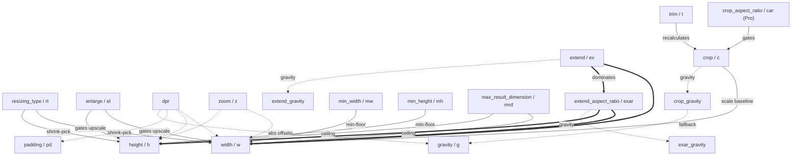

# imgproxy processing-option graph

A reference map of **every** imgproxy URL processing option (OSS **and** Pro) and
the typed relationships between them: which options depend on which, which take
precedence over others, which rewrite another's numbers, and in what order the
pipeline applies them.

This is a **vendor reference**, not an ImagePipe conformance doc — it catalogues
imgproxy's full surface (including options ImagePipe has not implemented yet) so
the graph is ready to consult as we build them out. For what ImagePipe currently
supports and where it diverges, see [`imgproxy_support_matrix.md`](imgproxy_support_matrix.md).

## Sources (ground truth)

- Option surface & semantics: imgproxy docs — `docs/usage/processing.mdx`.
- Execution order & interaction conditions: imgproxy OSS source — `processing/*.go`
  (`processing.go`, `prepare.go`, `extend.go`, `crop.go`, `padding.go`,
  `calc_position.go`, `scale_on_load.go`, `trim.go`).
- Pro-only options are documented but closed-source, so their pipeline positions
  are **inferred from the docs** and flagged as such.

**Derived from** (pin these when re-deriving or auditing the line numbers):

| Repo | Version | Commit | Date |
| --- | --- | --- | --- |
| imgproxy (source) | `v4.0.4-23-g5fb3b51b` | `5fb3b51be743c0f162d1aa96d5012312b75062ab` | 2026-06-10 |
| imgproxy-docs | — | `fdc6d8a248a76f4597edaeadf08542418cc68daf` | 2026-06-09 |

Diagrams use Mermaid (GitHub renders it inline). Line numbers below track the
imgproxy commit above; treat them as a starting point, not a permanent anchor.

---

## Edge taxonomy

The graph uses five relationship types. Keep them distinct — they answer
different questions.

| Type | Meaning | Mermaid style |
| --- | --- | --- |
| **requires** | The source option is a **no-op unless** the target is set. | thick arrow `==>` |
| **dominates** | Both target the same outcome; the source wins and the target goes **inert**. | thick arrow labelled `dominates` |
| **gates** | A flag/value that **enables or changes** how the target behaves. | solid arrow `-->` |
| **scales** | The source **rewrites the target's numeric** parameters. | dotted arrow `-.->` |
| **gravity** | The op **consumes a gravity** (each has its own slot). | dotted arrow labelled `gravity` |

---

## 1. Pipeline order

The OSS execution order is fixed in `mainPipeline` (`processing/processing.go:17-37`).
URL option order never changes it — options route to a fixed stage.

Grey/dashed stages are **not directly user-option-driven** — they run from
internal computation (preshrink, colorspace, result-crop, format-limit fixups).

| # | Stage | Driven by | OSS/Pro |
| --- | --- | --- | --- |
| 1 | `vectorGuardScale` | internal: cap vector resolution to `max_src_resolution` | OSS (auto) |
| 2 | `trim` | `trim` / `t` | OSS |
| 3 | `scaleOnLoad` | internal: preshrink from `width`/`height`/`dpr`/`enlarge` | OSS (auto) |
| 4 | `colorspaceToProcessing` | internal; respects `preserve_hdr` / `ph` | OSS (auto) |
| 5 | `crop` | `crop` / `c` (+ `crop_gravity`, falls back to `gravity`) | OSS |
| 6 | `scale` | `width` `height` `resize` `resizing_type` `enlarge` `dpr` `zoom` `min_width` `min_height` | OSS |
| 7 | `rotateAndFlip` | `rotate` `flip` `auto_rotate` | OSS |
| 8 | `cropToResult` | internal result-space crop, uses `gravity` | OSS (auto) |
| 9 | `applyFilters` | `blur` `sharpen` `pixelate` | OSS |
| 10 | `extend` | `extend` / `ex` | OSS |
| 11 | `extendAspectRatio` | `extend_aspect_ratio` / `exar` | OSS |
| 12 | `padding` | `padding` / `pd` | OSS |
| 13 | `fixSize` | internal: clamp to format max dimensions | OSS (auto) |
| 14 | `flatten` | `background` / `bg` (`background_alpha` Pro) | OSS |
| 15 | `watermark` | `watermark` / `wm` (+ `watermark_*` Pro) | OSS |

**Pro stages (positions inferred from docs):** `crop_objects` before stage 5;
`crop_aspect_ratio` right after stage 5; `resizing_algorithm` selects the stage 6
kernel; the color/effect family (`adjust`, `brightness`, `contrast`, `saturation`,
`monochrome`, `duotone`, `colorize`, `gradient`, `unsharp_masking`, `blur_areas`,
`progressive_blur`, `blur_detections`, `draw_detections`) sits at/after stage 9;
`objects_position` adjusts stage 8; `dpi` is metadata after stage 14;
`autoquality` / encoder `*_options` run at encode (after the pipeline).

---

## 2. Geometry interaction graph

This is where the relationships are dense. (Independent leaves — format, quality,
effects, watermark, metadata — are catalogued in §4 but carry no geometry edges.)

### Reading the key edges

- **`exar` ⟹ `width` & `height`.** Extend-aspect-ratio only fires when *both*
  target dimensions are set (`TargetWidth > 0 && TargetHeight > 0`,
  `prepare.go:204`). One dimension missing → no-op.
- **`ex` dominates `exar`.** `extend` runs *before* `extendAspectRatio`
  (pipeline 10 → 11) and fills the image to the exact target box. `exar`'s canvas
  is always ≤ that box, so `extendImage` early-returns
  (`if width <= imgWidth && height <= imgHeight { return nil }`, `extend.go:7`).
  Since `exar`'s eligibility (both dims set) is exactly the regime where `extend`
  fills the box, **whenever `extend` is enabled with both dimensions, `exar` is
  inert** — including its gravity. The two are effectively mutually exclusive with
  `extend` holding priority. `exar` only ever affects pixels with `extend` off.
- **`dpr` scales, `zoom` does not (everything).** Both multiply target
  width/height (`TargetW = Scale(width, DprScale * ZoomWidth)`, `prepare.go:176`).
  But **`dpr` also scales padding** (`padding.go:12`) and **absolute gravity
  offsets** (`|offset| >= 1` → `RoundToEven(offset * dpr)`, `calc_position.go:25`);
  `zoom` touches neither. Relative offsets (`|offset| < 1`) are unaffected by both.
- **Three separate gravities.** `crop`, `extend`, and `exar` each read their own
  gravity slot; the post-scale `cropToResult` uses the general `gravity`. `crop`'s
  slot falls back to general `gravity` when unset; the others default to centre.
  They never interfere.
- **`enlarge` gates upscaling.** With `enlarge` off, a source smaller than the
  target is not scaled up; the target acts as a ceiling, not a target
  (`prepare.go:120-143`). This is *also* why a small source under `ex` lands in a
  large mostly-empty canvas while under `exar` it gets only a thin strip.
- **`trim` recalculates everything.** Trim changes the effective source bounds and
  re-runs `CalcParams()` (`trim.go:27`), so all downstream crop/scale math keys off
  the trimmed image.

### Edge reference (verified against OSS source)

| From → To | Type | Condition | imgproxy ref |
| --- | --- | --- | --- |
| `exar` → `width`,`height` | requires | fires only if `TargetWidth>0 && TargetHeight>0` and the scaled image doesn't already match the target ratio | `prepare.go:204` |
| `ex` → `width`/`height` | requires | needs ≥1 target dim > 0; fills to `TargetWidth`×`TargetHeight` | `extend.go:3-30` |
| `ex` → `exar` | dominates | `ex` fills the box first; `exar` canvas ≤ box ⇒ early return | `extend.go:7`, pipeline 10→11 |
| `enlarge` → `width`/`height` | gates | off ⇒ no upscaling; target becomes a ceiling | `prepare.go:120-143` |
| `resizing_type` → `width`/`height` | gates | picks shrink (fit=max, fill/fill-down=min); governs missing-dim behaviour | `prepare.go:67-111` |
| `min_width`/`min_height` → `width`/`height` | gates | post-enlarge floor; overrides target to guarantee a minimum result | `prepare.go:146-158` |
| `resizing_type=fill-down` → result crop | gates | `fill-down && !enlarge` ⇒ asymmetric result crop | `prepare.go:182-202` |
| `max_result_dimension` → scale | gates | post-padding ceiling; downscales all scales if exceeded | `prepare.go:223-264` |
| `dpr` → `width`/`height` | scales | `TargetDim = Scale(dim, DprScale·Zoom)` | `prepare.go:176-177` |
| `dpr` → `padding` | scales | `pad = ScaleToEven(pad, DprScale)` | `padding.go:12-15` |
| `dpr` → gravity offsets | scales | absolute (`\|off\|≥1`) only; relative untouched | `calc_position.go:25-35` |
| `zoom` → `width`/`height` | scales | multiplies target dims; **not** offsets/padding | `prepare.go:176-177` |
| `crop` → scale | gates | crop reduces `widthToScale=MinNonZero(CropW,SrcW)` baseline | `prepare.go:274-280` |
| `crop_aspect_ratio` (Pro) → `crop` | gates | corrects crop-area aspect before scaling | docs `processing.mdx#crop-aspect-ratio` |
| `trim` → all geometry | recalculates | `trim()` ⇒ `CalcParams()` re-derives src/crop/scale | `trim.go:27` |
| `crop` → `crop_gravity` | gravity | own slot; falls back to general `gravity` if unset | `crop.go:33`, pipeline gravity wiring |
| `cropToResult` → `gravity` | gravity | post-scale crop uses general `gravity` | `crop.go:63-66` |
| `extend` → `extend_gravity` | gravity | own slot, default centre | `extend.go:28` |
| `exar` → `exar_gravity` | gravity | own slot, default centre | `extend.go:42` |
| `rotate`+`auto_rotate` → crop dims | gates | `(exif+user)%180==90` swaps crop W/H | `crop.go:55-56` |

---

## 3. Meta-options & aliases

Some options are pure sugar that expand to others — model them as expansion, not
behaviour:

- **`resize` / `rs`** = `resizing_type` + `width` + `height` + `enlarge` + `extend`
  (`rs:type:w:h:enlarge:extend`). The 5th arg **is** the `extend` (`ex`) flag.
- **`size` / `s`** = `width` + `height` + `enlarge` + `extend` (no type).
- **`adjust` / `a`** (Pro) = `brightness` + `contrast` + `saturation`.

> **Alias collision (imgproxy's own):** `co` is the documented short alias for
> **both** `contrast` and `crop_objects` (both Pro), and `pg`/`pgs` etc. are
> distinct. Disambiguation is by context. When ImagePipe implements these, the
> parser must resolve `co` deliberately rather than assume a single owner.

---

## 4. Full option catalogue (OSS + Pro)

Every URL processing option. Availability per `processing.mdx`. "Geometry edges"
points back to §2 where relevant.

### Sizing & geometry

| Option | Alias | Avail | Syntax |
| --- | --- | --- | --- |
| `resize` | `rs` | OSS | `rs:%type:%width:%height:%enlarge:%extend` |
| `size` | `s` | OSS | `s:%width:%height:%enlarge:%extend` |
| `resizing_type` | `rt` | OSS | `rt:%type` (fit/fill/fill-down/force/auto) |
| `resizing_algorithm` | `ra` | Pro | `ra:%algorithm` (nearest/linear/cubic/lanczos2/lanczos3) |
| `width` | `w` | OSS | `w:%width` |
| `height` | `h` | OSS | `h:%height` |
| `min-width` | `mw` | OSS | `mw:%width` |
| `min-height` | `mh` | OSS | `mh:%height` |
| `zoom` | `z` | OSS | `z:%zoom` or `z:%zoom_x:%zoom_y` |
| `dpr` | — | OSS | `dpr:%dpr` |
| `enlarge` | `el` | OSS | `el:%enlarge` |
| `extend` | `ex` | OSS | `ex:%extend:%gravity` |
| `extend_aspect_ratio` | `extend_ar`, `exar` | OSS | `exar:%extend:%gravity` |

### Cropping & positioning

| Option | Alias | Avail | Syntax |
| --- | --- | --- | --- |
| `crop` | `c` | OSS | `c:%width:%height:%gravity` |
| `crop_aspect_ratio` | `crop_ar`, `car` | Pro | `car:%aspect_ratio:%enlarge` |
| `trim` | `t` | OSS | `t:%threshold:%color:%equal_hor:%equal_ver` |
| `crop_objects` | `co` | Pro | `co:%scale_factor:%class_name1:...` |
| `gravity` | `g` | OSS | `g:%type:%x_offset:%y_offset` (incl. `sm`/`fp`/`obj`/`objw`) |
| `objects_position` | `obj_pos`, `op` | Pro | `op:%type:%x_offset:%y_offset` |

### Canvas & background

| Option | Alias | Avail | Syntax |
| --- | --- | --- | --- |
| `padding` | `pd` | OSS | `pd:%top:%right:%bottom:%left` |
| `background` | `bg` | OSS | `bg:%R:%G:%B` or `bg:%hex` |
| `background_alpha` | `bga` | Pro | `bga:%alpha` |

### Rotation & flipping

| Option | Alias | Avail | Syntax |
| --- | --- | --- | --- |
| `auto_rotate` | `ar` | OSS | `ar:%auto_rotate` |
| `rotate` | `rot` | OSS | `rot:%angle` (0/90/180/270) |
| `flip` | `fl` | OSS | `fl:%horizontal:%vertical` |

### Color & tone (Pro)

| Option | Alias | Avail | Syntax |
| --- | --- | --- | --- |
| `adjust` | `a` | Pro | `a:%brightness:%contrast:%saturation` |
| `brightness` | `br` | Pro | `br:%brightness` |
| `contrast` | `co` | Pro | `co:%contrast` |
| `saturation` | `sa` | Pro | `sa:%saturation` |
| `monochrome` | `mc` | Pro | `mc:%intensity:%color` |
| `duotone` | `dt` | Pro | `dt:%intensity:%color1:%color2` |
| `colorize` | `col` | Pro | `col:%opacity:%color:%keep_alpha` |

### Filters & effects

| Option | Alias | Avail | Syntax |
| --- | --- | --- | --- |
| `blur` | `bl` | OSS | `bl:%sigma` |
| `sharpen` | `sh` | OSS | `sh:%sigma` |
| `pixelate` | `pix` | OSS | `pix:%size` |
| `unsharp_masking` | `ush` | Pro | `ush:%mode:%weight:%divider` |
| `blur_areas` | `ba` | Pro | `ba:%sigma:%left1:%top1:%width1:%height1:...` |
| `progressive_blur` | `pbl` | Pro | `pbl:%sigma:%direction:%start:%stop` |
| `blur_detections` | `bd` | Pro | `bd:%sigma:%class_name1:...` |
| `draw_detections` | `dd` | Pro | `dd:%draw:%class_name1:...` |
| `gradient` | `gr` | Pro | `gr:%opacity:%color:%direction:%start:%stop` |

### Watermarking

| Option | Alias | Avail | Syntax |
| --- | --- | --- | --- |
| `watermark` | `wm` | OSS | `wm:%opacity:%position:%x_offset:%y_offset:%scale` |
| `watermark_url` | `wmu` | Pro | `wmu:%url` |
| `watermark_text` | `wmt` | Pro | `wmt:%text` |
| `watermark_size` | `wms` | Pro | `wms:%width:%height` |
| `watermark_rotate` | `wm_rot`, `wmr` | Pro | `wmr:%angle` |
| `watermark_shadow` | `wmsh` | Pro | `wmsh:%sigma` |

### Format & quality

| Option | Alias | Avail | Syntax |
| --- | --- | --- | --- |
| `format` | `f`, `ext` | OSS | `f:%extension` |
| `quality` | `q` | OSS | `q:%quality` |
| `format_quality` | `fq` | OSS | `fq:%format1:%quality1:...` |
| `autoquality` | `aq` | Pro | `aq:%method:%target:%min_quality:%max_quality:%allowed_error` |
| `max_bytes` | `mb` | OSS | `mb:%bytes` |
| `jpeg_options` | `jpgo` | Pro | `jpgo:%progressive:%no_subsample:...` |
| `png_options` | `pngo` | Pro | `pngo:%interlaced:%quantize:%quantization_colors` |
| `webp_options` | `webpo` | Pro | `webpo:%compression:%smart_subsample:%preset` |
| `avif_options` | `avifo` | Pro | `avifo:%subsample` |

### Metadata & processing control

| Option | Alias | Avail | Syntax |
| --- | --- | --- | --- |
| `strip_metadata` | `sm` | OSS | `sm:%strip_metadata` |
| `keep_copyright` | `kcr` | OSS | `kcr:%keep_copyright` |
| `strip_color_profile` | `scp` | OSS | `scp:%strip_color_profile` |
| `preserve_hdr` | `ph` | OSS | `ph:%enable` |
| `enforce_thumbnail` | `eth` | OSS | `eth:%enforce_thumbnail` |
| `dpi` | — | Pro | `dpi:%dpi` |
| `color_profile` | `cp`, `icc` | Pro | `cp:%profile` |
| `style` | `st` | Pro | `st:%style` (SVG only) |

### Animation & video (Pro)

| Option | Alias | Avail | Syntax |
| --- | --- | --- | --- |
| `page` | `pg` | Pro | `pg:%page` |
| `pages` | `pgs` | Pro | `pgs:%pages` |
| `disable_animation` | `da` | Pro | `da:%disable` |
| `video_thumbnail_second` | `vts` | Pro | `vts:%second` |
| `video_thumbnail_keyframes` | `vtk` | Pro | `vtk:%keyframes` |
| `video_thumbnail_tile` | `vtt` | Pro | `vtt:%step:%columns:%rows:...` |
| `video_thumbnail_animation` | `vta` | Pro | `vta:%step:%delay:%frames:...` |

### URL & cache control

| Option | Alias | Avail | Syntax |
| --- | --- | --- | --- |
| `skip_processing` | `skp` | OSS | `skp:%ext1:%ext2:...` |
| `raw` | — | OSS | `raw:%raw` |
| `cachebuster` | `cb` | OSS | `cb:%string` |
| `expires` | `exp` | OSS | `exp:%timestamp` |
| `filename` | `fn` | OSS | `fn:%filename:%encoded` |
| `return_attachment` | `att` | OSS | `att:%return_attachment` |
| `preset` | `pr` | OSS | `pr:%preset1:%preset2:...` |
| `fallback_image_url` | `fiu` | Pro | `fiu:%url` |

### Security & limits

| Option | Alias | Avail | Syntax |
| --- | --- | --- | --- |
| `max_src_resolution` | `msr` | OSS | `msr:%resolution` |
| `max_src_file_size` | `msfs` | OSS | `msfs:%size` |
| `max_animation_frames` | `maf` | OSS | `maf:%size` |
| `max_animation_frame_resolution` | `mafr` | OSS | `mafr:%size` |
| `max_result_dimension` | `mrd` | OSS | `mrd:%size` |
| `hashsum` | `hs` | Pro | `hs:%hashsum_type:%hashsum` |

---

## Maintenance

This doc tracks imgproxy, not ImagePipe. Revisit it when bumping the imgproxy
reference checkout (option surface or pipeline order may shift). When ImagePipe
implements one of these options, record support/divergence in
[`imgproxy_support_matrix.md`](imgproxy_support_matrix.md) — that's the conformance
home; this is the map.
