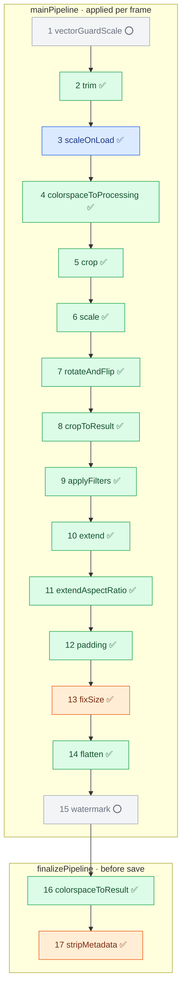

# Imgproxy support matrix

This matrix compares ImagePipe's current imgproxy support with Imgproxy's
processing URL and configuration surfaces.

ImagePipe intentionally treats Imgproxy URLs as a compatibility parser for a
product-neutral `ImagePipe.Plan`. Supported options translate cleanly into
canonical plan/output/cache/response fields. Unsupported options fail before
source fetch or cache lookup. ImagePipe doesn't ignore them.

## Two stacks serve imgproxy URLs

Phase 1 of the dialect inversion added a second, independent stack. Both are
live; a host picks one at mount time.

| Stack | Mounted as | Owns |
| --- | --- | --- |
| **Framework** | `plug ImagePipe.Plug, parser: ImagePipe.Parser.Imgproxy, …` | parse → `Plan` → `Resolver` strategy → `Executor`; the request chain is `ImagePipe.Request.*` |
| **Dialect** | `plug ImagePipe.Dialect.Imgproxy, …` | its whole request chain, assembled directly from ImagePipe's core toolkit; no `Plan` resolution strategy, no `ImagePipe.Request.*` |

Unless a row says otherwise, **both stacks are conformant and produce identical
bytes**: the wire-conformance suite and the differential suite both dual-run
every case against both stacks, plus a cross-arm raw-body-hash equality set. The
"Realized in" column below names both where they differ.

Where the two stacks are **not** equivalent, it is on surfaces outside the three
conformance axes (cache keys, ETags, telemetry, and options the dialect config
has no key for yet). Those are enumerated in
[Dialect-stack divergences](#dialect-stack-divergences) — read that section
before mounting the dialect.

Conformance has three axes. This document covers two of them; the third lives in
the test suite:

| Axis | Question | Where |
| --- | --- | --- |
| **Surface** | Do we accept the same URL options / config? | the option/config tables below |
| **Stage / order** | Do we run the same processing stages, in a compatible order, realized where? | [Processing pipeline conformance](#processing-pipeline-conformance) |
| **Behavioral / pixel** | Does a matching stage produce matching output? | wire conformance tests (`test/image_pipe/imgproxy_wire_conformance_test.exs`) + the "Diverges" notes throughout |

A single feature can pass one axis and fail another: `fixSize` (in the pipeline
section) is *surface*-invisible (no option/config), *stage*-conformant, and
*behaviorally* equivalent for WebP/AVIF — it only becomes legible on the stage
axis. References to imgproxy source below use imgproxy's own repository layout
(`processing/…` in `github.com/imgproxy/imgproxy`); ImagePipe doesn't vendor it.

## Processing pipeline conformance

imgproxy processes each image through a fixed, ordered pipeline. Most stages have
no env var and no URL option, so they have no row in the configuration/URL tables
below — yet they are exactly where compatibility lives. This section maps each
imgproxy stage onto the ImagePipe layer that realizes it.

ImagePipe doesn't execute imgproxy's pipeline directly: it parses to a
product-neutral `ImagePipe.Plan` whose transform order is fixed by the
parser/plan layer (URL option order is irrelevant — see
[transform_operations.md](transform_operations.md) and
[imgproxy_path_api.md](imgproxy_path_api.md)), then executes that plan across
three layers — **decode planning**, the **transform chain**, and the **output
boundary**. The diagram colours stages by which layer realizes them; the tables
carry the detail.

**Colour = ImagePipe layer:** 🟦 decode planning · 🟩 transform chain · 🟧 output
boundary (clamp / encoder finalize) · ⬜ not realized.
**Emoji = conformance:** ✅ matches · ⚠️ diverges · ⭕ missing (in scope, not built).

### Input format detection (source preamble)

Before the per-frame pipeline, ImagePipe detects the source format from a bounded
≤32KB header peek (magic bytes + a lightweight SVG structural scan), mirroring
imgproxy's `imagetype` package. This is input conditioning, not a `Plan`
operation — like decode access mode and shrink-on-load planning, it is sourced
from the bytes, which no operation struct can see. It gates unsupported formats
(gif/bmp/ico/svg) before libvips opens the bytes and is authoritative for the
format where magic is confident.

**Diverges from imgproxy's `imagetype`:**

- **`:unknown` → libvips fallback.** imgproxy hard-rejects `Unknown`; ImagePipe
  falls back to its existing libvips classification, staying as capable as the
  libvips build. Detection is an authoritative-where-confident gate, not a hard
  allowlist.
- **No ct/ext hints → no RAW-vs-TIFF skip.** imgproxy's TIFF detector skips
  itself when the (content-type/extension) hint is in its RAW list — so on its
  real download path, which always passes those hints, a RAW file sharing TIFF
  magic yields `Unknown` (→ reject). ImagePipe does not wire content-type/extension,
  so the same RAW file detects as `:tiff` (its current behavior). Deferred with
  the dimension-sniffing follow-on (#264).
- **SVG: root-only vs match-anywhere.** imgproxy's XML tokenizer classifies SVG
  when an `<svg>` start element appears *anywhere* in the prolog-led token stream;
  ImagePipe's lightweight scan matches only the **root** element. A non-root
  `<svg>` (e.g. wrapped in another root element) that imgproxy would call `svg`
  falls to `:unknown` here → libvips `svgload`, which still rejects it — so no
  wrong-accept, only a label difference on an already-rejected input.
- **JP2 detection added.** ImagePipe detects JPEG 2000 (signature box + J2K
  codestream); imgproxy's `imagetype` has no JP2 detector. Unmatched JP2 variants
  fall to `:unknown` → libvips `jp2kload`.
- **Vocabulary maps to ImagePipe atoms** (`:heif` not `heic`, `:jpeg_xl` not
  `jxl`, `:jpeg2000`); the avif-vs-heif codec split is taken from libvips, which
  is more precise than `ftyp`-brand sniffing for generic-brand AVIF.

### Main pipeline

imgproxy's `mainPipeline` (`processing/processing.go`), applied per frame:

| # | imgproxy stage | Realized in ImagePipe | Status | Notes |
| --- | --- | --- | --- | --- |
| 1 | `vectorGuardScale` | — | ⭕ | Gated on SVG/vector input support, which isn't implemented yet (SVG is rejected after decode identifies an SVG loader, before transforms). In scope; this pre-scale stage follows once SVG input lands. (see "Source input formats") |
| 2 | `trim` | `lib/image_pipe/transform/operation/trim.ex` | ✅ | Replicates imgproxy `vips_trim`: (1) colourspace-convert to sRGB for detection; (2) flatten alpha onto magenta `{255,0,255}` before detecting; (3) smart bg = top-left pixel `getpoint(0,0)` of the prepared image; (4) `find_trim` to locate the border box; (5) equal_hor / equal_ver symmetrization — each pair of opposite margins is made equal to the *smaller* inset (trims less aggressively, symmetrically); (6) degenerate box (`width==0 \|\| height==0`) → image returned **unchanged**; (7) extract from the **original** image, preserving its colorspace/alpha. Materializing op (`requires_materialization?: true`). **Storage-frame under deferred orientation (stage/order, [#182](https://github.com/hlindset/image_pipe/issues/182)):** imgproxy trims at stage 2, *before* `rotateAndFlip` (stage 7), so the trim box is computed on **un-oriented** pixels. ImagePipe defers EXIF/user orientation to a late flush, so for an oriented source trim materializes the storage frame to RAM **without** applying the pending orientation (`Materializer.materialize_without_orientation/1`), runs `find_trim`/crop there, and leaves the orientation for the boundary flush. This keeps the two frame-sensitive inputs storage-frame to match imgproxy: the smart `getpoint(0,0)` background is sampled at the **storage** top-left corner (not the rotated display corner), and `equal_hor`/`equal_ver` symmetrize the **storage** axes (which transpose vs the display axes under EXIF 5–8). A plain uniform-border trim commutes with rotation and is unaffected. **Differential coverage (behavioral/pixel):** `equal_hor`/`equal_ver` symmetrization is baked on an **asymmetric** border (`trim_equal_hv_border` → the off-center `border_asym` source, `t:10::1:1`): plain trim → tight 1300×1000 bbox, symmetrization → 1400×1080 reaching into the white border (maxΔ 0). The centered `border` source cannot exercise it (equal opposite margins → `diff==0` no-op, byte-identical to plain trim), so a missing-symmetrization regression would have passed there. The storage-axis transpose under EXIF is separately pinned by `trim_equal_h_exif5`. **Disables shrink-on-load when in the first pipeline** (mirrors imgproxy nil-ing `ImgData` at stage 2, before `scaleOnLoad` at stage 3). Trim in a later pipeline does not disable pipeline-1 scale-on-load. Trim's detection inherits working-space pixels because the input color preamble (`lib/image_pipe/transform/input_color_management.ex`) runs before all operations — pixel-equivalent to imgproxy calling `colorspaceToProcessing` inside `vips_trim`. **Minor bounded divergence — sRGB-skip uses stored header interpretation**, not imgproxy's `guess_interpretation`: at most an extra idempotent sRGB round-trip, no dimension effect (see stage 4 notes). |
| 3 | `scaleOnLoad` | **decode planning** — `lib/image_pipe/transform/decode_planner.ex` | ✅ | Shrink-on-load computed as a libvips load option (`shrink`/`scale`), not a transform op. Decode opens `:sequential`. The realized factor (`decode_shrink`) and stored extent (`source_dimensions`) are **confined to the pipeline whose decode produced them** — a preceding crop and the residual resize each clear them, so an absolute crop in a later chained (`/-/`) pipeline is sized against that pipeline's input, not rescaled by a stale factor (#180). This matches imgproxy Pro chained pipelines (`IMGPROXY_MAX_CHAINED_PIPELINES`): each pipeline is a full processing pass over the previous pipeline's in-memory output, so `scaleOnLoad`'s preshrink factor (`scale_on_load.go`) exists only for the initial decode and never carries into a later pipeline. |
| 4 | `colorspaceToProcessing` | `lib/image_pipe/transform/input_color_management.ex` (fixed preamble) | ✅ | ImagePipe imports **every** profiled/wide-gamut/CMYK source to a working space (sRGB for 8-bit; B_W for greyscale) via a fixed preamble — `Executor.execute/3` on the framework stack, `Dialect.Imgproxy.Pipeline.run/4` on the dialect stack — unconditionally, before trim and all geometry — regardless of `scp`. **Stage/order (dialect inversion):** the preamble has a required postamble, the carry stamp that tells `Output.Encoder`'s colorspace-to-result step an import ran. It used to be written by a private function in `Request.Processor` (framework-only), so it was unreachable from any dialect and every dialect encoded profiled sources with wrong pixels (an `scp:0` P3 source was off by 113 on a 0-255 channel). It now lives with the preamble it belongs to, as `Transform.InputColorManagement.stamp_carry/1`; `Request.Processor` delegates to it and both dialects call it at their pipeline tail. Same stage, same bytes, one owner — pinned by `ImagePipe.Dialect.ColorCarryParityTest`. Mirrors imgproxy `colorspaceToProcessing`: import gating (has profile, not canonical sRGB-IEC61966, UCHAR/USHORT coding), PCS sniff, 16-bit-alpha band split/rejoin, and linear-source skip (scRGB). For untagged/already-sRGB inputs the preamble is a no-op. **Minor bounded divergence (stage/order):** ImagePipe's working-space chooser and sRGB-IEC61966 skip read the **stored** libvips interpretation (header), where imgproxy uses `vips_image_guess_interpretation` for those same checks. For all normally-decoded sources — the full conformance suite — the stored and guessed interpretations agree; they can diverge only for atypical inputs whose stored interpretation is unset or MULTIBAND. The working-space chooser now consumes the resolved HDR policy (`Format.supports_hdr?(format)` and `Plan.Output.hdr == :preserve`), threaded as a pre-transform `supports_hdr?` boolean from the Request/Output boundary; previously hardwired SDR (the #121 seam). For 16-bit sources this keeps RGB16/GREY16 when the format carries HDR, else collapses to sRGB/B_W. **Differential coverage (behavioral/pixel):** the `cmyk_import` case pixel-conforms the unconditional CMYK→sRGB import against the OSS bake (a 120×90 CMYK JPEG under a no-op `rs:fit:200:200`, isolating the import with no resampling — maxΔ 0). Distinct from `cp:cmyk` CMYK *output* targeting (#214). |
| 5 | `crop` | `lib/image_pipe/transform/operation/crop.ex` | ✅ | Pre-resize crop with anchor / focal-point / smart / object gravity. **Gravity inheritance (surface/behavioral):** a bare crop (`c:W:H` with no inline gravity args) inherits the **entire** top-level `g:` option — both the type *and* its x/y offsets — matching imgproxy ("when gravity is not set, [crop] uses the value of the gravity option"); an inline crop gravity (`c:W:H:type[:x:y]`) fully specifies its own gravity and offsets. Resolved in `plan_builder.ex` `crop_gravity/2`; pinned pixel-wise by `crop_inherit_grav_offset` (byte-identical to the inline `grav_no_off`). **Crop-size rounding (behavioral/pixel, [#318](https://github.com/hlindset/image_pipe/issues/318)):** a fractional crop dimension (`c:0.x` → `< 1` fraction of the source) resolves the crop **size** with **round-half-away-from-zero** (`Geometry.round_half_away_from_zero`), matching imgproxy `CalcCropSize` → `imath.Scale` → `math.Round` (`processing/prepare.go`, `imath/imath.go`). This is deliberately distinct from the **ties-to-even** rounding used for crop *position/offset* composition (`RoundToEven`, `calc_position.go`) — sizes round away, positions round to even. On a `.5` tie the two modes differ by 1px; pinned by `crop_relative_dims_odd_tie` (the odd-dimensioned `placement_odd` source, `c:0.5:0.5` → 405·0.5=202.5, 305·0.5=152.5 → 203×153, where ties-to-even would give 202×152). The same size-rounding convention extends to the `crop_aspect_ratio` (`car`) correction (see its row in the option table) — both its corrected dimension and its shrink-to-bounds clamp round half-away; since `car` is Pro (no OSS oracle) that is convention-based and unit-pinned, not bake-verified. |
| 6 | `scale` | `lib/image_pipe/transform/operation/resize.ex` | ✅ | `fit`/`fill`/`fill-down`/`force`/`auto`, enlarge, min-width/height, zoom, dpr. Pro `resizing_algorithm` (`ra`) missing. The fit/fill ratio, zoom, and dpr fold into a **single** `imath.Scale` per axis (`round(source × scale)`, one round — `prepare.go` `calcScale`/`calcSizes`), not a fit-round then a dpr-multiply; on a fractional fit dimension this matches imgproxy exactly (`rs:fit:300:200/dpr:2` on 1600×1200 → 533×400, and the dpr=1 auto-axis `rs:fit::200` enlarge → 183×200) (#199). **`auto` fill-vs-fit (behavioral, #233):** `rt:auto` buckets by the **sign** of the source/target width−height difference (`prepare.go:88-97`), with a square dimension (`D == 0`) sharing the non-negative (landscape) bucket; cover fills only when both source and target land in the same bucket, else fit. So square↔landscape pairs fill (cover + result-crop) rather than fit — `auto_resize_square_target_marker` (landscape→square) and `auto_resize_square_source_icc` (square→landscape) pin both directions. **`rt:auto` classified in the display frame (stage/order, [#182](https://github.com/hlindset/image_pipe/issues/182)):** that sign comparison runs on **display-frame** source dims — imgproxy's `ResizeAuto` swaps `srcW`/`srcH` via `ExtractGeometry` for a quarter turn *before* comparing (`prepare.go`). Under deferred orientation, that display-frame classification is owned by the **neutral** resolver (`ImagePipe.Transform.NeutralResolver.resolve_mode/2`, [#448](https://github.com/hlindset/image_pipe/issues/448)) — the fill-vs-fit rule is product-neutral (imgproxy is only its provenance), so any dialect may emit `:auto` with no resolver. Both stacks then read that concrete branch back to size the no-enlarge effective-DPR padding-scale cap, itself computed against the display-frame source dims: the framework stack through its resolution strategy (`ImagePipe.Parser.Imgproxy.Resolver`, [#434](https://github.com/hlindset/image_pipe/issues/434), whose strategy-private `display_source_dims/1` swaps the storage axes for a pending quarter turn), the dialect stack in `Dialect.Imgproxy.Pipeline`'s own resize clause, which calls `NeutralResolver.resolve_mode/2` directly and carries the cap in a pipeline-local variable rather than resolver state. Both resolve on the display axes, so an EXIF 5–8 / `rot:90`/`270` source is not judged on transposed axes and does not pick fit where imgproxy picks fill. |
| 7 | `rotateAndFlip` | `.../transform/pending_orientation.ex`, `.../transform/orientation_flush.ex`, `.../transform/orientation.ex`, `.../operation/rotate.ex`, `.../operation/flip.ex` | ✅ | EXIF auto-orient + user rotate/flip are carried as deferred `pending_orientation` state and applied **late** at the orientation-flush boundary — **after** crop/resize, with crop gravity and resize dimensions compensated into the storage frame (`orientation.ex`, a port of imgproxy `gravity.go` `RotateAndFlip`) so the observable result matches. Compose suborder EXIF → user-rotate → user-flip; EXIF auto-orient is the default. Flush streams EXIF orientations 1/2 and materializes 3–8 (and any quarter/half-turn user rotate or vertical flip). The same storage↔display compensation extends to shrink-on-load: a gravity crop carrying a pending quarter turn swaps the storage-frame `decode_shrink` per-axis factors before rescaling its display-frame dims (#185). imgproxy rescales crop dims in the **display** frame (its `SrcWidth`/preshrink are `ExtractGeometry`-swapped — `prepare.go`); ImagePipe reaches the same result by swapping the storage-frame factors ahead of the quarter-turn crop swap. **EXIF coverage:** the differential suite exercises all eight EXIF orientations — including the flip∘quarter-turn compose paths (transpose 5 / transverse 7) that a lone orientation-6 quarter-turn could not reach. imgproxy derives angle and flip for all eight orientations in `angleFlip` (`prepare.go`) and sequences EXIF rotate → EXIF flip → user rotate → user flip in `rotateAndFlip` (`rotate_and_flip.go`); ImagePipe follows the same compose order. **Rotation primitive (behavioral):** both the deferred user rotate (`orientation_flush.ex`) and the executable `Operation.Rotate` apply the exact `vips_rot` (the same primitive `autorotate` runs for EXIF), not libvips' arbitrary-angle affine resampler — the affine path leaves a 1px black edge seam even for 90° multiples (#211). This makes the flip∘quarter-turn ∘ user-`rot:90` compose (transpose 5 / transverse 7) pixel-exact at the frame and block edges, matching imgproxy's vips_rot orientation (`exif_5_cover_rot90`, `exif_7_cover_rot90`). |
| 8 | `cropToResult` | `lib/image_pipe/transform/operation/crop.ex` (result crop after a resize) | ✅ | `Resize` deliberately does **not** crop; plan execution emits a **separate** result crop to the requested box (gravity center, bounded to the image — imgproxy `MinNonZero`). The crop box is the **literal requested dimensions** (`result_box_*`, not the min-expanded target — imgproxy's universal `cropToResult` crops to `ResultCropWidth/Height = TargetWidth/Height = Scale(po.Width, DprScale·Zoom)`), so the min-dimension guarantee survives on the short axis while the overflowing axis is trimmed back to what was asked for. For `fill`/`fill_down` the cover resize always overflows the box, so the crop always fires (`cover_resize_and_crop`, and the quarter-turn `cover_resize_and_crop_display_frame`, both crop to `result_box_*`). For `fit` the scaled image normally fits inside the box and no crop is emitted — **except** when `mw`/`mh` force a min-dimension upscale past the box on an axis (e.g. `rs:fit:300:300/mw:280/mh:280` on 1600×1200 → scale 373×280, crop to 300×280, #194; cover arm `rs:fill-down:200:200/mw:400/mh:400` on 1600×1200 → 200×200, #236). The `mw`/`mh` > target regime is pinned by the `fill_down_min_dims_placement` and `fill_mw_mh_above_target` cover probes (the existing `cover_min_dims_marker` has `mw`/`mh` *below* the target, so it is inert; both probes source the aperiodic `placement` grid so the centered cover result-crop carries discriminating pixels rather than a #239 marker dead region, with a Δ16 tol for the 8× downscale resample skew). **fill-down asymmetric crop when target > source (behavioral):** `fill-down` never upscales, so when the requested box is larger than the source the result crop is **not** the literal box (which, bounded to the smaller image, is a no-op) but the image cropped to the requested **aspect ratio** — imgproxy's `calcSizes` overrides `ResultCropWidth/Height` to `ScaledWidth` × `Scale(ScaledWidth, TargetHeight/TargetWidth)` (or the height-led mirror) in the `ResizeFillDown && !enlarge` branch (`prepare.go:182-202`). This is carried on the neutral plan by `Plan.Operation.Resize.down` (set only for `fill-down`); the shared `resize_from/2` column (`lib/image_pipe/transform/resize_planning.ex`) maps a `:cover` branch with `down: true` to the transform `:fill_down` mode so `resolve_dimensions` computes the asymmetric `result_box` (`fill_down_result_box/3`). A `:cover`-branch `down: true` operation has two sources today, both imgproxy: the framework stack's resolution strategy ([#434](https://github.com/hlindset/image_pipe/issues/434)) and — since the dialect inversion — `Dialect.Imgproxy.Assembly`, which emits `down: true` on the `Plan.Operation.Resize` **with no resolution strategy at all**. So `fill_down` is no longer "reachable only through the imgproxy resolution strategy": the `down` field is plain neutral-plan data that any dialect may set, and the strategy is one of two emitters rather than the gate. Without the `down` distinction `fill-down` collapsed onto plain `fill` and left the wrong aspect ratio (`rs:fill-down:600:400` on the 120×90 `small` source → 120×80, not 120×90); pinned by `fill_down_target_gt_source_small`. **Stage/order:** a resize emission resolving through the resolver now splits into two stages at the realized-dims read — the resize runs, the driver measures the realized dims, and the result crop is parameterized against those **measured** post-resize dims rather than the naively computed target (`resolved_box_dims`), so a resize whose realized dims round ±1 off the naive target still hands `cropToResult` the exact box `Crop.execute` will produce. Same integers as before; no surface or pixel change. |
| 9 | `applyFilters` | `lib/image_pipe/transform/operation/{blur,sharpen,pixelate,brightness,contrast,saturation,monochrome,duotone,colorize,gradient}.ex` | ✅ | Supported effect subset; order documented in [transform_operations.md](transform_operations.md). Only **blur / sharpen / pixelate** are OSS (imgproxy's `apply_filters.go` applies exactly these three) and thus differentiable against the OSS bake; **brightness / contrast / saturation / monochrome / duotone / colorize / gradient are imgproxy-Pro** — ImagePipe-implemented features exposed through the dialect, not OSS parity (no wire-diff; see the option table) — so they are *not* differential gaps. Pro filters `unsharp_masking`, `blur_areas`, `progressive_blur` are entirely missing. **Differential coverage (stage/order):** the OSS subset's fixed order — imgproxy `vips.c` `apply_filters` runs blur → sharpen → pixelate, which `effect_operations` matches — is pinned end-to-end by `effects_chain_order_high_freq` (`bl:2/sh:2/pix:8` stacked; a reordered chain would diverge grossly), alongside the isolated `pixelate_marker`, `blur_zone`, and `sharpen_zone` cases. **Pixelate kernel (behavioral, [#238](https://github.com/hlindset/image_pipe/issues/238)):** pixelate downsamples with `vips_shrink` (a pure box mean) + `vips_zoom` (nearest enlarge), matching imgproxy's `vips.c` `apply_filters` exactly — the mirror-embed-to-integer-multiple preamble makes the shrink an exact integer factor, vips_shrink's domain. A box mean is bounded by the source range, so it cannot ring/overshoot the way libvips' default Lanczos resize kernel does at sharp edges; `pixelate_marker`, `effects_chain_order_high_freq`, and `exif_182_pixelate` are now byte-identical (maxΔ=0). **Display frame under deferred orientation (stage/order, [#182](https://github.com/hlindset/image_pipe/issues/182)):** `applyFilters` runs at stage 9, *after* `rotateAndFlip` (stage 7). Blur/sharpen commute with right-angle rotation, but pixelate's block grid does not (a non-multiple size leaves partial edge blocks that must land on the **display** edge). When pixelate runs with an orientation still pending — the resize-less path; any resize would already have flushed — ImagePipe flushes the pending orientation first so the grid aligns to the display frame. |
| 10 | `extend` | `lib/image_pipe/transform/operation/extend_canvas.ex` | ✅ | Canvas extension with anchor gravity and offsets. Non-alpha sources gain an opaque alpha and the padding is transparent black `(0,0,0,0)` (imgproxy `vips_embed_go`: `addalpha` + `VIPS_EXTEND_BLACK`). Centered placement uses imgproxy's `calc_position.go` origin `ShrinkToEven(outer − inner + 1, 2)` — the same center origin as the result crop — **not** a floor of `(outer − inner)/2`, which slipped the content 1px on an odd gap (#195). **DPR scaling:** the extend target box (`TargetWidth = Scale(width, DprScale)`, `prepare.go`) and absolute offsets (`offX = RoundToEven(offset × DprScale)` for `abs(offset) ≥ 1`, `calc_position.go`) both scale by the effective DPR; the imgproxy resolution strategy carries a **composition-preserving** scale from the resize to the canvas op (the same `:canvas_preserving` scale padding uses, which — like imgproxy's `prepare.go:136` — skips the enlarge-off DprScale compensation so the extend composition stays dpr-stable). Zoom is not folded into that scale (a bounded limitation shared with padding). **Offset placement matches `calc_position.go`:** west/north/center add the offset, right/bottom anchors move the image *away* from the anchored edge (`left = outer − inner − offX`), and the resolved origin clamps to `[0, outer − inner]` (allowOverflow=false) (#200). **Inert no-op ([#220](https://github.com/hlindset/image_pipe/issues/220)):** when the extend resolves to *no actual padding* (the resized image already fills the requested canvas and any offset clamps to zero), the embed is skipped and the image is left untouched — matching imgproxy's `extendImage()` early return (`width <= imgWidth && height <= imgHeight`), so a non-alpha source stays 3-band instead of gaining a spurious alpha channel. |
| 11 | `extendAspectRatio` | `lib/image_pipe/transform/operation/extend_canvas.ex` (`{:aspect_ratio, ratio}` rule) | ✅ | `extend_ar`/`exar`; no-op when a resize dimension is auto/zero. `fp` extend-gravity not supported. Shares the stage-10 centered-placement parity (#196). The AR canvas box is image-relative (computed from the already-dpr-scaled image), so it needs no separate DPR scaling; it inherits the stage-6 single-round scale, so a fractional fit dimension under `dpr` lands at imgproxy's width (`rs:fit:300:200/exar:1/dpr:2` → 533 centred in the 600×400 canvas, #199). |
| 12 | `padding` | `lib/image_pipe/transform/operation/padding.ex` | ✅ | CSS-style shorthand, effective DPR scaling. **Display frame under deferred orientation (stage/order, [#182](https://github.com/hlindset/image_pipe/issues/182)):** padding runs at stage 12, *after* `rotateAndFlip` (stage 7), so `pt`/`pr`/`pb`/`pl` land on **display** sides. imgproxy `padding` does not require `w`/`h`, so "EXIF-rotated source + asymmetric padding, no resize" is reachable; with a resize present the resize-triggered flush already fires first, but the resize-less path needs the op to flush the pending orientation before padding. ImagePipe does so, so asymmetric padding lands on the display sides regardless of whether a resize is present. (Symmetric padding masks the difference; `ExtendCanvas`/`extend` is incidentally protected because `extend` requires `w`/`h`, forcing a resize and therefore a flush.) **No-enlarge effective-DPR cap (behavioral, [#237](https://github.com/hlindset/image_pipe/issues/237)):** imgproxy's `!Enlarge()` block *always* runs `DprScale = min(DPR, min(wshrink, hshrink))`, so a geometry-less dpr (`pd:…` + `dpr`, no `w`/`h` — which still emits a no-op `auto/auto` resize) caps `DprScale` to 1 (`wshrink=hshrink=1`) and leaves padding unscaled (`pd:10:4:2:8/dpr:2` on a 300×400 display → 312×412). Both stacks compute this cap once at the resize and carry it to padding: the framework stack in its resolution strategy ([#434](https://github.com/hlindset/image_pipe/issues/434)), as carried resolver state; the dialect stack in `Dialect.Imgproxy.Pipeline`, as a pipeline-local variable re-seeded per `-` pipeline. The cap (`max_padding_scale_without_enlarge`) returns the real `1.0` for the `auto/auto` requested box rather than treating it as uncapped, matching imgproxy on both the resize-bearing (`exif_182_auto_pad_dpr_cap`) and resize-less (`padding_asym_dpr_exif`) arms. |
| 13 | `fixSize` | **output boundary** — `lib/image_pipe/output/clamp.ex` (#150) | ✅ | Format-aware encoder dimension clamp. Realized at the **Output boundary**, not the transform chain: the realized image is uniformly downscaled to the chosen encoder's hard limit (WebP 16383, AVIF 16384). Mirrors imgproxy's `processing/fix_size.go` (`fixWebpSize`/`fixHeifSize`). Emits `[:output, :clamp]` ([telemetry.md](telemetry.md)); covered by the wire conformance tests. The host `max_result_*` caps fold into this same clamp via `min(host, encoder)` (#165); ImagePipe's result-pixel cap uses an **independent linear-dimension + sqrt-pixel** rule, deliberately **not** `fixGifSize`'s combined-sqrt (which can leave a result over the dimension limit). |
| 14 | `flatten` | `lib/image_pipe/transform/operation/background.ex` (explicit `bg`) + **encoder finalize** — `lib/image_pipe/output/encoder.ex` (`flatten_for_format`, format-driven) | ✅ | imgproxy's single `flatten` stage fires when **either** a background is set (`ShouldFlatten`) **or** the result format can't carry alpha (`!Format().SupportsAlpha()`), compositing onto `po.Background()` (default `color.White`). ImagePipe splits the two triggers across two realization sites. **Explicit `bg`/`bga` (`background.ex`):** an alpha flatten onto `background`/`background_alpha` emitted into the transform chain when requested; default black. **Format-driven default flatten (encoder boundary, behavioral/pixel — [#268](https://github.com/hlindset/image_pipe/issues/268)):** when the resolved output format lacks alpha (`Format.supports_alpha?` false — JPEG today) and the working image still carries alpha, the encoder composites onto `Plan.Output.flatten_background` (a `Plan.Color`, default opaque white = imgproxy's `color.White`) in `finalize/2` **before** `colorspaceToResult` (the first stage of the separate finalize pipeline) — matching imgproxy's flatten-before-colorspaceToResult order. Guarded by `has_alpha?`, so an explicit `bg` (already flattened upstream in the chain) and any opaque image pass through untouched; this is why the field is consulted only here for the no-`bg` case — a requested background was consumed in the chain. The default is the declarative seam for a future dialect/host to set; no parser overrides it today (imgproxy itself has no server-level background config, only the per-request `bg`), so it composes into the cache key/ETag but is currently always white. Without this flatten `jpegsave` on an alpha image silently drops alpha to black (and rejects a 2-band greyscale+alpha outright → 500) instead of imgproxy's white flatten. |
| 15 | `watermark` | — | ⭕ | In scope, not yet implemented (consistent with the watermark rows in "Background, effects, and overlays" and "Watermark defaults and custom watermark cache"). |

### Finalize pipeline

imgproxy's `finalizePipeline` (`processing/processing.go`), applied before save:

| # | imgproxy stage | Realized in ImagePipe | Status | Notes |
| --- | --- | --- | --- | --- |
| 16 | `colorspaceToResult` | **encoder finalize** — `lib/image_pipe/output/encoder.ex` (`color_result`) | ✅ | The encoder finalize state machine reads `Plan.Output.color_profile` (`:preserve_source`, `:strip`, or `{:convert, target}`) and the `imagepipe-icc-imported` / `imagepipe-icc-backup` fields stamped by the delivery seam: when `:preserve_source` + imported + format supports profiles, re-export to the restored source profile (`icc_export`); when `:strip` + imported, the image is already in the working space — drop the profile; when neither side imported (untagged/sRGB source), convert-to-standard (`icc_transform`) is a no-op. **Target conversion (`cp`/`icc`):** `{:convert, target}` runs `convert_to_target` here — working-space sRGB → the named built-in profile via `icc_transform`, embedding the target (greyscale promoted to sRGB first); it overrides `scp` (a converted target is embedded, never stripped) and reuses this same finalize seam (no new stage). **Format-ignored parity:** imgproxy ignores `cp` when the output format can't carry a profile; ImagePipe's `convert_to_target` returns the image un-embedded when `Format.supports_color_profile?` is false — vacuous for the four current formats (all carry profiles), load-bearing once CMYK (#214) lands. Always unconditional — matches imgproxy `colorspaceToResult` running before save regardless of `scp`. **Profile-drop field list (behavioral):** when the profile is dropped (`scp:1`/default, no `cp`), `maybe_drop_profile` removes the exact field set imgproxy's `vips_icc_remove` strips — the ICC blob **and** three EXIF color-characterization tags (`exif-ifd0-WhitePoint`, `exif-ifd0-PrimaryChromaticities`, `exif-ifd2-ColorSpace`) — and does so independent of `sm`, so they are stripped even under `sm:0`. imgproxy's internal `imgproxy-icc-profile` carry has no ImagePipe analogue to remove (ImagePipe's private `imagepipe-icc-*` carry fields are stripped at stage 17). **Bounded non-divergence:** of the three, only `WhitePoint`/`PrimaryChromaticities` are output-observable; libvips reconstructs `exif-ifd2-ColorSpace` from the encoded image's color interpretation on JPEG write, so it reappears identically on both imgproxy and ImagePipe output. |
| 17 | `stripMetadata` | **encoder finalize** — `lib/image_pipe/output/encoder.ex` | ✅ | Strips EXIF/XMP/IPTC at encode, after the stage-16 color-result step completes. **Diverges** on `keep_copyright` (preserves EXIF copyright/artist only; imgproxy keeps full XMP/IPTC). ICC handling is owned by stage 16; the strip runs after re-embed or drop. See "Metadata, color, and source decoding". |

### Surrounding stages

imgproxy wraps the pipelines with load, size-gating, format determination, and
save. ImagePipe realizes these at request and output boundaries:

| imgproxy stage | Realized in ImagePipe | Status | Notes |
| --- | --- | --- | --- |
| Initial load + source-resolution gate (`MaxSrcResolution`) | decode + `max_input_pixels` (hard error) | ✅ | The image-bomb gate is a hard error, not a downscale — matches imgproxy. `max_body_bytes` caps the fetched body. |
| Output format determination | `lib/image_pipe/output/negotiation.ex`, `lib/image_pipe/output/policy.ex` | ✅ | `Accept` negotiation for JPEG XL/AVIF/WebP with `Vary: Accept` (server preference **AVIF > JPEG XL > WebP**, host-reorderable via the core `format_order` option; each format gated by `auto_jpeg_xl`/`auto_avif`/`auto_webp`, default on). **Diverges (stage/order, deliberate):** imgproxy's documented preference is **JPEG XL > AVIF > WebP** (`processing.go` checks `PreferJxl` before `PreferAvif`); ImagePipe leads with AVIF because at the ssim2 web-delivery quality target AVIF is both smaller and sharper than JPEG XL (JXL only pulls ahead near visual-losslessness). A host can restore imgproxy-parity order with `format_order: [:jpeg_xl, :avif, :webp]`. Explicit `@extension`/`.extension` (incl. `jxl`) bypasses negotiation. A modern format is negotiated only from its **explicit mime** (`image/jxl`/`image/avif`/`image/webp`); the `image/*` wildcard is **not** a modern-format signal — parity with imgproxy's explicit-mime detection (`clientfeatures/detector.go` substring-matches `image/jxl`/`image/avif`/`image/webp` only), and necessary because real Chrome/Firefox `` requests send `image/*` while unable to decode JPEG XL. `enforce_*`, `preferred_formats` missing. |
| Host result-dimension cap (`limitScale`, `processing/prepare.go`) | `lib/image_pipe/output/clamp.ex` via the producer (`min(max_result_width/max_result_height/max_result_pixels, encoder_limit)`, both dialects, `SharedConfig`-validated) | ✅ | imgproxy downscales the result to fit `max_result_*`; ImagePipe matches for the common no-padding/no-extend request (#165), reusing the #150 `Output.Clamp` — byte-intent identical to `limitScale`'s linear `downScale = maxResultDim/max(outW,outH)` (`prepare.go:247`) when caps are equal and a dimension binds. **Diverges (superset):** ImagePipe honors independent `max_result_width`/`max_result_height` and a result `max_result_pixels` cap (sqrt), where imgproxy's `limitScale` has a single `MaxResultDimension` and no result-pixel cap. **Diverges (composition):** ImagePipe clamps the **composited** final image, whereas imgproxy folds the downscale into the resize scale and re-applies padding/extend at the reduced scale (`prepare.go:233-263`) — both land ≤ cap, but padded/extended requests differ in the **content-to-padding ratio of the final frame**. ImagePipe mirrors imgproxy's per-axis sub-1px floor (`prepare.go:252-258`) via `max(scale, 1/dim)`; in the extreme-aspect 1px regime the realized pixels can still differ for the same composited-vs-fold-back reason. **Stage/order (#164, approach A):** on the plain (non-oriented) path the clamp runs on the lazy composite *before* the delivery materialization, so libvips fuses resize→clamp (also crop→clamp and embed→clamp — verified across fit, cover, and canvas/padding by the #164 benchmark probes) and avoids forming the full oversized intermediate. Served output is unchanged (pixels, dims, content-type, status, cache key, ETag) and the `[:output, :clamp]` event's metadata is identical — an internal memory optimization. (One ordering nuance: the clamp event now fires *before* the delivery materialize, so it can precede a rare materialize-failure 415 where it previously would not — it never changes served output.) The oriented mid-chain flush still materializes pre-clamp (deferred). |
| Save / encode | `lib/image_pipe/output/encoder.ex` | ✅ | Streams the encoded result. **JPEG XL** is the exception: it is encoded through Vix directly to a seekable memory **buffer** (the `image` wrapper rejects the `.jxl` suffix and `jxlsave` cannot write a non-seekable delivery pipe) and delivered buffered, not streamed; its quality maps to libjxl's `Q`, and a butteraugli `distance` mapping is **implemented** for the native-JXL autoquality path (below). With no explicit quality, JPEG XL now encodes at the configured default `Q77` (see "Default output quality"), matching imgproxy's `FORMAT_QUALITY` JXL value — the previous default-*quality* divergence for AVIF/WebP/JXL is closed. **Diverges (behavioral) — `jxl_effort` default 7 vs imgproxy 4:** JXL `effort` is now host-tunable via the neutral `jxl_options` config key (`Plan.Output.JxlOptions{effort: 1..9}`; no URL form — imgproxy's `effort` is env-only too). ImagePipe's neutral default is **7** — libvips `jxlsave`'s own current default, so an unset effort is byte-identical to an explicit `effort=7` (re-checkable against the pinned libvips version) — whereas imgproxy's `IMGPROXY_JXL_EFFORT` defaults to **4** (`vips/config.go`). The imgproxy parity overlay is **empty today**, so ImagePipe ships effort 7 and imgproxy 4: their JXL output bytes differ. Setting the overlay's `jxl_options: %JxlOptions{effort: 4}` is the documented byte-parity lever. The `autoquality`/`max_bytes` quality search (`lib/image_pipe/output/encode_search.ex`) is an output/encode-stage **re-encode loop** — a binary search over encoder quality — with no per-option knob for the loop mechanics themselves (analogous to the other config-less internal stages above); it gates on `Format.supports_quality?` (jpeg/webp/avif/jpeg-xl). **Native-JXL butteraugli single-encode path (stage/order + behavioral):** when the autoquality metric is `butteraugli` **and** the output format is JPEG XL, the search does **not** run the band loop — it drives libvips' native `distance` knob (`.jxl[distance=…]`, libjxl's own *"Target butteraugli distance"*) directly in a **single encode** (`iterations: 0`, `outcome: :native`). The `[min_quality, max_quality]` Q-bracket is clamped into distance space via libjxl's Q→distance formula (`lib/image_pipe/output/jxl_distance.ex`, pinned byte-identical to `.jxl[Q=…]` by a drift-guard test) so an explicit max_quality is never exceeded; if `max_bytes` is set the path **self-caps** by raising `distance` geometrically from the clamped target until the bytes fit or it saturates at libvips' `distance` ceiling (25.0, `outcome: :best_effort`, `limiting_factor: :max_bytes`). No external metric NIF runs on this path (`distance` *is* butteraugli distance). butteraugli on non-JXL formats keeps the external-measure band search. **Crop-scored `:ssim2` above a ~6 MP crossover (stage/order, #354):** above an internal ~6 MP crossover the `:ssim2` objective scores K=16 native-resolution p10-tiles of the full-res encode per probe (a flat ~4.2 MP metric sample regardless of source size) — a **calibrated approximation** of the full-frame pick within a bounded residual (~±2 q), tightened by one full-frame confirm + bounded bump on the winner; below the crossover the full-frame search is unchanged. The crossover is **internal** (it only selects the scorer, not a user knob); `autoquality_max_resolution` is unchanged and still *disables* the search above the host cap (it is strictly above the crossover in precedence). No imgproxy wire oracle exists (autoquality is Pro/closed and ImagePipe uses SSIMULACRA2, not DSSIM), so the chosen-quality behavior is validated against ImagePipe's own full-frame search via the benchmark (`docs/autoquality_benchmark.md`), not against imgproxy. Advanced/codec-specific encoder knobs are now supported via the libvips-native per-format encoder options (see "Advanced encoder options" and the `*_options` rows under "Output and encoding"). |

### Key takeaways

- **Order is plan-owned, not URL-owned** — imgproxy's stage order is realized by
  ImagePipe's fixed `ImagePipe.Plan` transform order; URL option order doesn't
  define it.
- **Not every imgproxy stage is a transform op** — `scaleOnLoad` is decode
  planning, `fixSize` is the output boundary, `stripMetadata`/`colorspaceToResult`
  are encoder finalize. The "Realized in" column is the map.
- **Color management (#124) is resolved.** Stages 4 and 16 are now ✅: every
  input is unconditionally imported to a working space before trim and geometry
  (`InputColorManagement` preamble), and the encoder finalize re-embeds or drops
  the source profile per `Plan.Output.color_profile`. The host result cap
  downscales to match imgproxy (#165), with a deliberate, strictly-safe superset:
  independent per-axis width/height + a result-pixel cap, and a composited-image
  clamp point. A minor bounded divergence remains at stage 4: the working-space
  chooser and sRGB-IEC61966 skip use the stored header interpretation rather than
  imgproxy's `guess_interpretation` — agreement for all normally-decoded sources,
  potential divergence only for atypical MULTIBAND/unset inputs (see stage 4 notes).
  Everything else either matches or is an explicitly missing/out-of-scope surface
  documented in the tables below.

## Dialect-stack divergences

`ImagePipe.Dialect.Imgproxy` is conformant with the framework stack on all three
axes above **for every case both arms run** — and that is substantial: the
differential suite renders all **162 constellations on both arms** (no case is
framework-only) and asserts byte-for-byte equality against imgproxy-baked
fixtures, and **151 of the 154 wire cases run on both arms**, asserting status,
headers, content type, decoded pixels, and cache/source access order.

The carve-out is precise, not a hedge:

- **3 wire cases are framework-only**, each with a stated reason in the suite —
  the detector *model-identity* cache-key tests (`face_ver:`/`object_ver:` DI),
  which the dialect does not yet fold into its cache key (Task 6), not cases the
  dialect fails.
- **The § below lists real divergences** (telemetry stage-set) that hold on
  every request, not just the untested ones.

None of these is an imgproxy-conformance gap; all are ImagePipe-side, and a host
that mounts the dialect should read them.

Where a row says "shared with `Dialect.Native`", the behavior is a property of
the dialect architecture and ships today in `ImagePipe.Dialect.Native` — the
imgproxy dialect did not introduce it.

### Behavioral

- **`ETag`/`Cache-Control` byte-identity gate — aligned (was a divergence).**
  A source that resolves `cache_semantics.byte_identity: :none` (an ETag is a
  *strong byte-identity validator*, and such a source has none) now gets **no**
  `ETag` and `Cache-Control: no-store` on **all three** stacks. The framework
  does this in `Request.HttpCache`; the dialects reach the identical decision
  through `ImagePipe.Representation.build/3` /
  `Representation.response_headers/1`, the one seam both stacks call. Before this
  landed, both dialects (and shipped `Dialect.Native`) emitted a strong `ETag` +
  `must-revalidate` regardless, so a conditional GET 304'd against changed
  content and shared caches stored bytes the framework marks `no-store` — the
  same unreachable-core shape as the stage-4 colour-carry stamp, resolved the
  same way. The general "cache keys and ETags differ across the two stacks"
  (below) is unaffected: that is about the ETag *value* for a strong source, not
  whether one is emitted.
- **`g:obj:*`/`g:objw:*` are honored on both stacks (was a divergence — B1a).**
  The dialect gained a `:detector` config seam mirroring the framework's
  (`:default` → the bundled composite, `nil` to disable, or a module), seeded
  onto the transform state so the `{:detect, _}` guide reaches `Crop.execute/2`.
  Object-guided crop pixels, class filtering, and objw weights are now
  pixel-verified dual-run in the wire suite. The strict-mode capability gate is
  class-aware and mirrors `ImagePipe.Plug.validate_detector_capability/2`: under
  `detector_required: true`, an object-detect request whose configured detector
  is unavailable *for the requested classes* is rejected 422 before any source
  fetch or cache access; a composite that owns the face model but not the object
  model rejects `g:obj:car` while `g:obj:face` succeeds. Face-assist smart crops
  (`{:smart, :face_assist}`, produced by `g:sm` + `smart_crop_face_detection`)
  are deliberately excluded from the strict-mode gate on both stacks: with an
  unavailable face detector they degrade to attention (200), never reject (422).
  Both stacks read the flag and produce the guide — the framework off its
  `:imgproxy` config, the dialect by stamping the neutral flag onto its
  `PipelineRequest` — so when a face detector *is* available the guide biases the
  crop toward the detected face (a dual-run pixel-verified effect), not merely
  cache-key identity. **Remaining framework-only
  bit:** the detector *model identity* is not yet folded into the dialect's cache
  key, so a key does not change when a host swaps detector model versions
  (`face_ver:`/`object_ver:`). That is the cache-key-identity task (Task 6); until
  it lands, do not point both stacks at one cache store expecting model-version
  reuse to differ.
- **`/info` is cached; the framework never caches it.** A dialect-owned complete-
  body cache entry, honoring `internal_cache: :disabled`. No parity source exists
  (the framework's render path returns before any cache access).
- **Cache keys and ETags differ across the two stacks, deliberately.** They are
  ImagePipe storage identity, not an imgproxy surface. Do not point both stacks at
  one cache store expecting reuse.

### Observability

- **The dialect emits 7 fewer telemetry stages** (`[:send]`,
  `[:source, :fetch_decode]`, `[:transform, :execute]`,
  `[:transform, :input_color_management]`, `[:transform, :materialize]`,
  `[:output, :negotiate]`, `[:encode]`). Six are owned by framework-only modules
  the dialect does not route through. It emits `[:request]`, `[:parse]`,
  `[:source, :resolve]`, `[:cache, :lookup]`, `[:source, :fetch]`,
  `[:transform, :operation]`, and `[:deliver]` — no stage the framework does not,
  and the exact sequence `Dialect.Native` emits. Measured and pinned by
  `ImagePipe.ImgproxyTelemetryStageSetTest`. **Shared with `Dialect.Native`.**
- **A pre-delivery failure now carries a `:result` on `[:request, :stop]`**
  (resolved; was a divergence). Both dialects stamp the framework's own result
  vocabulary — `:ok` / `:not_modified` / `:parser_error` / `:plan_error` /
  `:source_error` / `:cache_error` / `:processing_error`, plus an `:error` tag —
  via the shared `ImagePipe.Telemetry.request_result/1` classifier, so
  `Telemetry.Logger`'s `outcome/1` and `level_for/3` see and escalate a failed
  dialect request as the framework does. A 502 is now `[:request, :stop] =
  :source_error`. `:processing_error` intentionally does not escalate at
  `[:request]`/`[:send]`/`[:deliver]` on either stack (it also carries normal
  client disconnects). Pinned by the "pre-delivery error" scenario in
  `imgproxy_telemetry_contract_test.exs`. **Shared with `Dialect.Native`.**
- **`[:output, :clamp]` is not emitted** even when the clamp fires.
- **`[:parse, :stop]`'s `:result` means different things.** The framework's
  `[:parse]` span encloses `PlanBuilder.to_plan/2`, so a geometry rejection
  (`rs:fill` with no dimensions) is `:error`; the dialect's `check_geometry/1`
  runs after the span closes, so the same request reports `:ok` and then 400s.
  Both reject pre-fetch.

### Unverified

- **Detector model identity in the cache key is unverified on the dialect
  stack.** Object-detect crop pixels, class filtering, objw weights, and the
  strict gate are now dual-run; the one uncovered slice is the cache-key
  sensitivity to detector model versions (`face_ver:`/`object_ver:`), deferred to
  the cache-key-identity task (Task 6).
- **3 wire-conformance cases run framework-only**, the detector model-identity
  cache-key tests (each gated `if @stack == :framework` with a stated reason).

## Differential conformance

`test/image_pipe/imgproxy_differential_conformance_test.exs` compares ImagePipe's
decoded pixel output against committed fixtures generated from a pinned real imgproxy
(`mix imgproxy.gen_fixtures`). It is the **behavioral/pixel** enforcement of this
matrix: each constellation carries a verdict that maps to a stage row.

- **`:equal`** (transform group, ✅ stages): tight count-based pixel agreement on PNG
  output against the fixtures' libvips (tolerances absorb minor libvips-version
  resampling differences). Stages exercised: trim (sRGB),
  scaleOnLoad (JPEG/WebP), crop, scale (fit/fill/fill-down/auto), rotate, extend,
  extendAspectRatio, padding, flatten, applyFilters (blur/sharpen), stripMetadata.
- **`:diverges`** (⚠️ rows): asserts a *structured* divergence still holds (region
  mean-delta ≥ floor), so an accidental convergence fails and forces a verdict flip
  here + a matrix update. The former colorspace #124 (`scp:0`) and trim-detection
  divergences have converged and moved to the `:equal` group.
- **lossy group**: dimension + content-type contract only (independent encoders), no
  pixel claim.
- **Combination constellations**: a focused set crossing option intersections the
  isolated cases don't (extend+offset+dpr, exar+dpr, min-dims+dpr, fit+min-dims+gravity,
  cover+min-dims, padding+dpr). **EXIF orientation constellations** exercise all eight
  EXIF orientations across fit/fill/extend/rotate combinations. The stage-6 fit+dpr
  rounding fold (#199, `extend_ar_dpr_marker`) and the stage-10 extend east/south offset
  sign + clamp (#200, `extend_offset_east_marker`) have converged and run in the default
  lane (the exar+dpr case carries a budget-256/Δ2 tol for a residual libvips-version
  resampling seam, not a placement error). The stage-7 EXIF transpose/transverse ∘
  user-`rot:90` 1px edge seam (#211, `exif_5_cover_rot90` / `exif_7_cover_rot90`) has
  converged — the user rotate now uses the exact `vips_rot` instead of the affine
  resampler — and runs in the default lane. The #203 backlog (Tier 1+2) broadens this
  with gravity across all three placement sites (inline crop `c:W:H:TYPE`, cover
  result-crop, extend) including corners and focal-point, crop+resize with two
  independent gravities live, the `force`/`auto`/`fill-down` resize paths, user
  `rot`/`flip` and EXIF∘user composes, trim×resize, and colorspace+blur — all
  PASS-confirmations on existing sources. The corner-extend case also surfaced the
  inert-extend spurious-alpha divergence (#220), now closed by the no-op
  short-circuit and pinned by `extend_inert_marker`. The #226 tail closes the
  remaining anchor × site cells: `west` on the inline crop (`crop_west_placement`) and
  cover result-crop (`cover_west_gravity_marker`) sites, `north` on extend
  (`extend_gravity_north_small`, the vertical mirror of `extend_gravity_small`), and
  a smart/attention pre-resize crop (`crop_smart_marker`, `c:W:H:sm`) — all exact
  PASS-confirmations at the strict default tol. A dedicated **gravity × offset matrix**
  (`grav_*`) then closes the per-direction offset cells systematically: all nine common
  gravity types (`ce`/`no`/`so`/`ea`/`we`/`noea`/`nowe`/`soea`/`sowe`), each with and
  without an x/y offset, as lossless inline crops (`c:480:360:TYPE[:x:y]`) on the
  aperiodic `placement` grid. Each direction is a distinct `calc_position.go` branch and
  the offset carries a per-edge sign (near edge adds, far edge subtracts, center offsets
  the centered base), so the matrix is realization coverage of the shared
  `gravity_position` math (the #200 clamp family) one branch at a time; a relative-unit
  offset case (`grav_ce_rel_off`, `<1` → `ScaleToEven(bounds·frac)`) also exercises the
  absolute-vs-relative offset branch. The non-square 480×360 crop blocks an x/y axis
  swap from hiding, and the asymmetric `120:80` offset moves the window inward so nothing
  clamps — all exact (maxΔ=0) PASS-confirmations at the strict default tol. The matrix
  also surfaced a bug-hunt cell: `crop_inherit_grav_offset` (`c:480:360/g:no:120:80`, the
  bare-crop-inherits-top-level-gravity form) caught a real divergence — ImagePipe
  inherited only the gravity *type*, not its offsets, so the window sat at north/(0,0)
  while imgproxy applied (120,80) (maxΔ 194, whole-frame shift). Closed in
  `plan_builder.ex` `crop_gravity/2`; the case now matches the inline `grav_no_off`
  byte-for-byte.

  A subsequent sweep of the cross-option interaction edges in
  [`imgproxy_processing_graph.md`](imgproxy_processing_graph.md) §2 added realization
  coverage for relationships that were implemented but never differentially verified —
  `ex` dominating `exar` (`ex_dominates_exar`), `zoom` scaling neither padding
  (`zoom_padding_no_scale`) nor offsets (`zoom_offset_no_scale`), `dpr` scaling absolute
  but not relative offsets (`cover_rel_offset_dpr_marker`), and the `exar` gravity slot
  (`exar_gravity_south_small`) — plus form coverage for `size`/`s`, single-dimension and
  resize-tail args, relative/full-axis crop dims, trim colour, and `bg` hex. That sweep
  surfaced a second structural divergence: `fill-down` with a target larger than the
  source (`fill_down_target_gt_source_small`) collapsed onto plain `fill` because the
  neutral plan didn't distinguish the two, dropping imgproxy's asymmetric crop-to-aspect
  (`prepare.go:182-202`). Closed by the `Plan.Operation.Resize.down` flag (see stage 8).
  Note `max_result_dimension` (`mrd`) remains **unimplemented** — carried as a **quarantine-as-spec**
  (`mrd_ceiling_marker`, `rs:fit:800:600/mrd:400` → imgproxy bakes 400×300, authored
  `:triage`): the parse gate skips it and the default lane excludes it, but imgproxy's
  fixture is baked and waiting, so dropping the `:triage` once `mrd` lands turns it into a
  ready-made conformance test. Baking security-gated options like `mrd` needs the bake
  container's `IMGPROXY_ALLOW_SECURITY_OPTIONS=true` (set in `imgproxy.gen_fixtures`; a
  no-op for constellations that use none), which also unlocks future `msr`/`msfs`/`maf`/`mafr`
  specs. `resizing_type`/`rt` as a standalone option (separate `w:`/`h:`) is now covered by
  `resizing_type_direct_marker` (≡ `rs:fit:300:200`, a distinct parse path). `watermark` is
  the other unimplemented OSS pixel option but needs a configured watermark asset to bake;
  `max_bytes` (implemented), `skip_processing`, `raw`, `enforce_thumbnail`, and the security
  *limits* are metadata/encode/cache/gate concerns the PNG pixel-differential can't
  meaningfully compare.

Regeneration and the libvips provenance model are documented in
`test/support/image_pipe/test/imgproxy_differential/README.md`.

### HDR preservation (`preserve_hdr` / `ph`)

For a 16-bit source:

| Output | `ph:1` effect |
| --- | --- |
| JPEG XL | preserved (16-bit working space → high-bit-depth encode) |
| AVIF | preserved (16-bit working space → high-bit-depth encode) |
| PNG  | preserved (16-bit PNG) |
| WebP | tone-mapped to 8-bit (`Format.supports_hdr?` false) |
| JPEG | tone-mapped to 8-bit (`Format.supports_hdr?` false) |

`ph:1` is a no-op for 8-bit sources regardless of format (matches imgproxy).

**Diverges:** imgproxy resolves the output format *before* processing (predicting
transparency from the source), so `SupportsHDR()` is always definitive. ImagePipe
resolves format *after* the transform when negotiation depends on the processed
image's alpha (`:source` mode + no modern `Accept` + modern source →
PNG-if-alpha/JPEG-if-not). In that one branch ImagePipe conservatively
tone-maps (`supports_hdr?` = false). For all other cases — explicit format, a
modern `Accept` candidate (incl. AVIF), or a jpeg/png passthrough source —
`supports_hdr?` is resolved pre-transform and matches imgproxy. Note also that
upstream `saveImage` has an AVIF-`<16px` → PNG/JPEG fallback that runs after the
HDR working space is fixed, so imgproxy itself can process 16-bit then save 8-bit
in that corner.

**Differential coverage (behavioral/pixel).** The PNG path is OSS-differentiable:
`rgb16_preserve_hdr` (`ph:1`, 16-bit PNG round-trip) and `rgb16_tonemap_8bit`
(`ph:0`, 8-bit) both pixel-conform against the OSS bake (maxΔ 0), and both RGBA
cases — `rgba16_tonemap_8bit` (8-bit) and `rgba16_preserve_hdr` (16-bit) — conform
within the default Δ2/64 tol. On the 16-bit RGBA case imgproxy premultiplies the RGB
by the (uniformly opaque) alpha before the resize and rounds the alpha a hair off
65535, where ImagePipe leaves a fully-opaque alpha untouched — ImagePipe is the
more-correct side, and the decoded footprint of the difference is a handful of
sub-tolerance skew samples (maxΔ ~9 levels). The differential comparator reconstructs
16-bit samples and judges deltas in 8-bit-equivalent levels
([#229](https://github.com/hlindset/image_pipe/issues/229)), so HDR fixtures get a
fair pixel claim instead of a low-byte blow-out.

## Status legend

The pipeline section above uses ✅ matches / ⚠️ diverges / ⭕ missing. The
configuration and URL/option tables below use a finer-grained legend:

| Status | Meaning |
| --- | --- |
| ✅ Supported | The parser translates this into `ImagePipe.Plan` or another request facet. |
| ⚠️ Partial | The parser supports some Imgproxy syntax or semantics, but not the whole option. |
| 🔗 URL-only | ImagePipe supports the request option, but not Imgproxy's global configuration default. |
| 🧩 Host-owned | Plug, router, or web-server configuration can provide this behavior outside ImagePipe. |
| 🚫 Rejected | Recognized or intentionally documented as unsupported, returning an error before side effects. |
| ⭕ Missing | Not implemented in the current parser/plan/runtime surface. |
| 🛑 Out of scope | Excluded from ImagePipe's library surface or delegated to host/runtime ownership. |

## Configuration options

ImagePipe doesn't read `IMGPROXY_*` environment variables. Variable markers show
whether ImagePipe has a matching or related `ImagePipe.Plug.init/1` option, source
adapter option, cache adapter option, or runtime option.

This section compares ImagePipe with imgproxy's configuration documentation
(`configuration/options.mdx`) and its config loaders (`*/config.go`) in
imgproxy's upstream repository.

### URL signature keys and trusted signatures

`imgproxy: [signature: [keys: [...], salts: [...], signature_size: n, trusted_signatures: [...]]]`.
ImagePipe expects already-split lists, not comma-separated environment strings.

- ✅ `IMGPROXY_KEY`
- ✅ `IMGPROXY_SALT`
- ✅ `IMGPROXY_SIGNATURE_SIZE`
- ✅ `IMGPROXY_TRUSTED_SIGNATURES`

### Server listener and connection limits

ImagePipe is a Plug. Bandit, Cowboy, Phoenix Endpoint, or another host server
owns socket binding, network family, and connection limits.

- 🧩 `IMGPROXY_BIND`
- 🧩 `IMGPROXY_NETWORK`
- 🧩 `IMGPROXY_MAX_CLIENTS`

### Request and response server timeouts

The host web server owns incoming request reads, response writes, and keep-alive
behavior. ImagePipe source adapters have separate fetch timeout options.

- 🧩 `IMGPROXY_READ_REQUEST_TIMEOUT`
- 🧩 `IMGPROXY_WRITE_RESPONSE_TIMEOUT`
- 🧩 `IMGPROXY_KEEP_ALIVE_TIMEOUT`

### Whole-request processing timeout

ImagePipe has source fetch and body-size limits, but no Imgproxy-style timeout
around the whole image request. A host can wrap the Plug, but ImagePipe doesn't
expose this as config.

- ⭕ `IMGPROXY_TIMEOUT`

### Authorization header secret

A host Plug or Phoenix pipeline can enforce `Authorization: Bearer ...` before
ImagePipe runs. ImagePipe itself doesn't check this header.

- 🧩 `IMGPROXY_SECRET`

### CORS response headers

`allow_origin` is a dialect-neutral runtime option (default off) shared by all
three stacks: `ImagePipe.Plug` (any mounted parser, not just IIIF),
`ImagePipe.Dialect.Imgproxy`, and `ImagePipe.Dialect.Native`
(`ImagePipe.Dialect.SharedConfig` validates and carries the key for both
dialects). When set, `ImagePipe.Response.CORS.maybe_register/2` registers a
`register_before_send/2` hook — the same hook on all three stacks — that
stamps `Access-Control-Allow-Origin: <value>` verbatim on **every** exit path:
image, `/info`, 304, and 4xx errors.

**The `OPTIONS`/method layer is shared by all three stacks.** `ImagePipe.Plug`,
`ImagePipe.Dialect.Imgproxy`, and `ImagePipe.Dialect.Native` all answer `OPTIONS`
with `204 No Content` + `Allow: GET, HEAD` (+ `Access-Control-Allow-Methods` when
`allow_origin` is set, via `Response.CORS.send_options/2`) and any other
non-GET/HEAD method with `405` + `Allow: GET, HEAD` (`Response.Sender.send_method_not_allowed/1`).
Both dialects route these ahead of the endpoint/pipeline split (`route/2` in
`imgproxy.ex`/`native.ex`), inside the same `[:request]` telemetry span the
framework uses, so the before-send CORS hook stamps these exits identically to
every other one.

- ✅ `IMGPROXY_ALLOW_ORIGIN` → `allow_origin` (configuration default; verbatim
  origin value, off when unset — same semantics as imgproxy's empty default).

**Diverges (behavioral) from upstream imgproxy on all three stacks:**

- **Non-GET/HEAD method: `405` + `Allow: GET, HEAD` vs imgproxy's `404`, no
  `Allow`.** imgproxy's router matches routes by exact method
  (`route.isMatch`, `server/router.go`); `/*` is only registered for `GET`,
  `HEAD`, and `OPTIONS`, so any other method never matches a route and falls
  through to the router's default `NotFoundHandler` (`server/router.go:145-158`)
  — a bare `404`, `text/plain`, no `Allow` header. ImagePipe treats this as a
  real method-not-allowed case instead.
- **`OPTIONS`: `204` + `Allow` (+ `Access-Control-Allow-Methods` when
  `allow_origin` is set) vs imgproxy's blank `200`, no `Allow`.** imgproxy
  routes `OPTIONS "/*"` to its generic `OkHandler` (`imgproxy.go`), which
  writes a bare `200 text/plain` (a single space byte) with no `Allow` header
  at all; `Access-Control-Allow-Methods: GET, OPTIONS` is present only because
  the route is separately wrapped in `WithCORS`, and only when
  `IMGPROXY_ALLOW_ORIGIN` is set. ImagePipe advertises
  `Access-Control-Allow-Methods: GET, HEAD, OPTIONS` (it also serves `HEAD`)
  and emits it only on the `OPTIONS` preflight response — imgproxy's
  `WithCORS` wraps `GET`, `HEAD`, and `OPTIONS` alike, so it stamps
  `Access-Control-Allow-Methods` on every CORS-configured response, not just
  preflight (the pre-existing, still-live divergence on that axis).
- **`HEAD`: processed like `GET` vs imgproxy's blank `200`.** imgproxy routes
  `HEAD "/*"` to the same `OkHandler` as `OPTIONS` — a fixed blank response
  that never touches the processing pipeline. ImagePipe's `HEAD` is not a
  method-layer case at all: it proceeds through the same `route/2` fallthrough
  as `GET` and is fully processed (source fetch, transform, encode, cache),
  matching `ImagePipe.Plug`'s existing behavior.

None of these are conformance gaps against a documented option — they are the
router-level shape of the method layer itself, deliberately diverging from
imgproxy's minimal exact-method-routing/fixed-handler design.

### Routing prefix

The router decides where ImagePipe mounts. ImagePipe parses the path segments it
receives after routing.

- 🧩 `IMGPROXY_PATH_PREFIX`

### Health check endpoint

The host app should expose health endpoints outside image processing routes.
ImagePipe doesn't include a health-check Plug.

- 🧩 `IMGPROXY_HEALTH_CHECK_PATH`
- 🧩 `IMGPROXY_HEALTH_CHECK_MESSAGE`

### Processing worker pool and request queue

ImagePipe doesn't expose an ImagePipe-owned worker pool or bounded request
queue; requests are processed per-request on the BEAM with no library-level
concurrency cap or load-shedding queue. Processing concurrency and back-pressure
are a host/runtime concern — a host can bound them with web-server connection
limits (cf. `IMGPROXY_MAX_CLIENTS`), a process pool, or a job queue — but none of
these are imgproxy-compatible configuration options ImagePipe owns.

- 🧩 `IMGPROXY_WORKERS`
- 🧩 `IMGPROXY_REQUESTS_QUEUE_SIZE`

### Source download request settings

`ImagePipe.Source.HTTP` supports `max_redirects`, `req_options`, and Req
timeout options. It doesn't provide Imgproxy's cookie forwarding,
request-header passthrough list, or SSL-verification environment switch.

- ✅ `IMGPROXY_DOWNLOAD_TIMEOUT`
- ✅ `IMGPROXY_MAX_REDIRECTS`
- ✅ `IMGPROXY_USER_AGENT`
- ⭕ `IMGPROXY_IGNORE_SSL_VERIFICATION`
- ✅ `IMGPROXY_CUSTOM_REQUEST_HEADERS`
- ⭕ `IMGPROXY_REQUEST_HEADERS_PASSTHROUGH`
- ⭕ `IMGPROXY_COOKIE_PASSTHROUGH`
- ⭕ `IMGPROXY_COOKIE_BASE_URL`
- ⭕ `IMGPROXY_COOKIE_PASSTHROUGH_ALL`

### Source URL rules and private-address policy

HTTP sources use `allowed_hosts` for host allow-listing — stricter and simpler
than Imgproxy's source-prefix glob rules. Resolved source IPs additionally pass
through an `address_policy` (`ImagePipe.Source.HTTP.AddressPolicy`) that
classifies each address and **denies non-public classes by default** — loopback,
link-local, private, unique-local, CGNAT, multicast, broadcast, reserved — with
per-class `allow_*` switches and CIDR `allow:` lists. The three imgproxy IP-class
flags map to `allow_loopback` / `allow_link_local` / `allow_private` (a superset;
imgproxy likewise denies these by default).

- ⚠️ `IMGPROXY_ALLOWED_SOURCES`
- ✅ `IMGPROXY_ALLOW_LOOPBACK_SOURCE_ADDRESSES` — `address_policy: [allow_loopback: true]`.
- ✅ `IMGPROXY_ALLOW_LINK_LOCAL_SOURCE_ADDRESSES` — `address_policy: [allow_link_local: true]`.
- ✅ `IMGPROXY_ALLOW_PRIVATE_SOURCE_ADDRESSES` — `address_policy: [allow_private: true]`.

### Local filesystem sources

Configure `sources: [path: {ImagePipe.Source.File, root: ..., root_id: ...}]`.
`root` is the local filesystem root. `root_id` gives cache keys a deterministic
source identity without storing the absolute path.

- ✅ `IMGPROXY_LOCAL_FILESYSTEM_ROOT`

### Non-HTTP source query separator

ImagePipe parses `?` for HTTP, HTTPS, and S3 plain sources. ImagePipe rejects
local/path source queries.

- ⭕ `IMGPROXY_SOURCE_URL_QUERY_SEPARATOR`

### S3 image sources

`ImagePipe.Source.S3` supports `s3://bucket/key` sources with configured
`region`, `endpoint`, credentials, and per-bucket overrides. Request URLs are
**always** built path-style (`endpoint/bucket/key`); there is no virtual-host
mode and no on/off toggle, so imgproxy's path-style flag has no configurable
equivalent (ImagePipe behaves as if it is permanently on). It doesn't provide
Imgproxy's enable flag, denied-bucket list, or decryption client. Assume-role is
provided as host config (see "S3 credentials" in `operational_notes.md`) rather
than env vars.

- ⚠️ `IMGPROXY_USE_S3`
- ✅ `IMGPROXY_S3_REGION`
- ✅ `IMGPROXY_S3_ENDPOINT`
- ⚠️ `IMGPROXY_S3_ENDPOINT_USE_PATH_STYLE` — path-style is the fixed behavior, not a configurable toggle.
- ⭕ `IMGPROXY_S3_USE_DECRYPTION_CLIENT`
- ✅ `IMGPROXY_S3_ASSUME_ROLE_ARN` — via `{:provider, ImagePipe.Source.S3.AssumeRole, role_arn: …}` (host config; see `operational_notes.md`).
- ✅ `IMGPROXY_S3_ASSUME_ROLE_EXTERNAL_ID` — via the `:external_id` option of `ImagePipe.Source.S3.AssumeRole`.
- ✅ `IMGPROXY_S3_ALLOWED_BUCKETS`
- ⭕ `IMGPROXY_S3_DENIED_BUCKETS`

### GCS, Azure Blob Storage, and Swift image sources

ImagePipe has no built-in GCS, Azure Blob Storage, or Swift source adapters.
Custom `imgproxy: [source_schemes: ...]` translators can map more schemes to
application-owned source adapters.

- ⭕ `IMGPROXY_USE_GCS`
- ⭕ `IMGPROXY_GCS_*`
- ⭕ `IMGPROXY_USE_ABS`
- ⭕ `IMGPROXY_ABS_*`
- ⭕ `IMGPROXY_USE_SWIFT`
- ⭕ `IMGPROXY_SWIFT_*`

### Encoded sources, encrypted sources, and URL rewriting

ImagePipe supports Base64 encoded source URLs. It also supports encrypted source
URLs when callers configure `source_url_encryption_key` through
`ImagePipe.Plug.init/1`. Direct `ImagePipe.Parser.Imgproxy.parse/2` callers should
validate the host options first with
`ImagePipe.Parser.Imgproxy.validate_options!(imgproxy: [...])` (which normalizes
the `:imgproxy` namespace in place and returns the full option list) and pass the
result as `parse/2`'s options.

- ✅ Base64 encoded source URLs
- ✅ Encrypted source URLs
- ✅ `IMGPROXY_BASE64_URL_INCLUDES_FILENAME`
- ⭕ `IMGPROXY_BASE_URL`
- ⭕ `IMGPROXY_URL_REPLACEMENTS`

ImagePipe supports encoded source syntax and encoded `.extension` output
suffixes. With `base64_url_includes_filename: true`, it discards the final
encoded-source segment before decoding Base64 or decrypting `/enc/` sources.
This matches imgproxy's SEO filename mode. Base URL prefixing and URL
replacements are separate source rewriting features and aren't implemented.

### Processing argument separator and allowed option list

The compatibility parser uses `:` as the argument separator, accepts its
implemented option set, rejects unsupported security override URL options
(see [Security limit overrides](#security-limit-overrides)), and has no
configured pipeline-count limit.

- ⭕ `IMGPROXY_ARGUMENTS_SEPARATOR`
- ⭕ `IMGPROXY_ALLOWED_PROCESSING_OPTIONS`
- 🚫 `IMGPROXY_ALLOW_SECURITY_OPTIONS`
- ⭕ `IMGPROXY_MAX_CHAINED_PIPELINES`

### Preset definitions

Configure preset definitions with `imgproxy: [presets: %{"name" => "w:100"}]`.
ImagePipe validates a map of preset names to option strings during
`ImagePipe.Plug.init/1`.

- ✅ `IMGPROXY_PRESETS`

### Preset loading and preset-only modes

ImagePipe has no environment/file loader or presets-only mode.

- ⭕ `IMGPROXY_PRESETS_SEPARATOR`
- ⭕ `IMGPROXY_PRESETS_PATH`
- ⭕ `IMGPROXY_ONLY_PRESETS`
- ⭕ `IMGPROXY_INFO_PRESETS`
- ⭕ `IMGPROXY_INFO_PRESETS_PATH`
- ⭕ `IMGPROXY_INFO_ONLY_PRESETS`

`IMGPROXY_INFO_PRESETS*` remain unsupported (Phase 1 info endpoint does not support named info presets).

### Output format detection

Automatic output negotiation supports JPEG XL, AVIF, and WebP with `auto_jpeg_xl`,
`auto_avif`, and `auto_webp` options (all default on) and emits `Vary: Accept`.
When a client accepts more than one, server preference picks **AVIF > JPEG XL > WebP**.
The order is host-configurable via the core `format_order` option (a list of distinct
modern-format atoms; a partial list prioritizes the listed formats and appends the
rest in default order). **Diverges (deliberate):** imgproxy prefers **JPEG XL > AVIF >
WebP** (`processing.go`); ImagePipe leads with AVIF because it is smaller *and* sharper
than JPEG XL at the ssim2 web-delivery target (JXL only wins near visual-losslessness).
Set `format_order: [:jpeg_xl, :avif, :webp]` to restore imgproxy-parity ordering.
A modern format is negotiated only from its explicit mime (`image/jxl`/`image/avif`/
`image/webp`); the `image/*` wildcard is treated as no modern-format signal and falls
back to source, matching imgproxy's explicit-mime detection — real Chrome/Firefox
`` requests send `image/*` but cannot decode JPEG XL.
It doesn't support enforced replacement of explicit formats or Imgproxy's
preferred-format fallback list.

ImagePipe probes libvips JPEG XL/AVIF/WebP write support at boot (the JPEG XL
probe exercises the Vix-direct buffer path the encoder uses, since the `image`
wrapper rejects `.jxl`). Automatic negotiation filters out formats the build
cannot write; a modern source format the client did not accept transcodes to
raster (PNG/JPEG by alpha). An explicit `format` the build cannot write is
rejected with `501` before source fetch.

**Diverges (`extend`/`padding` + auto format, [#235](https://github.com/hlindset/image_pipe/issues/235)):**
when that raster container is picked by alpha (a modern source the client did not
accept, no explicit `format`), ImagePipe reads the **final image's** `has_alpha?`,
while imgproxy predicts transparency from the **request** —
`expectTransparency = HasAlpha || PaddingEnabled() || ExtendEnabled()`
(`processing/processing.go`). So when `extend`/`padding` is requested but the result
is opaque (an opaque `bg`, or an inert extend, [#220](https://github.com/hlindset/image_pipe/issues/220)),
ImagePipe serves **JPEG** and imgproxy serves **PNG**. ImagePipe is the more-correct
side — it ships the smaller opaque container, with no alpha to lose — and this is the
same pre- vs post-transform resolution timing as the HDR `supports_hdr?` divergence
above. Reachable only on the non-passthrough source path (jpeg/png sources
short-circuit). Pinned by a wire test (`imgproxy_wire_conformance_test.exs`).

- ✅ `IMGPROXY_AUTO_WEBP`
- ✅ `IMGPROXY_ENABLE_WEBP_DETECTION`
- ✅ `IMGPROXY_AUTO_AVIF`
- ✅ `IMGPROXY_ENABLE_AVIF_DETECTION`
- ✅ `IMGPROXY_AUTO_JXL`
- ⭕ `IMGPROXY_ENFORCE_WEBP`
- ⭕ `IMGPROXY_ENFORCE_AVIF`
- ⭕ `IMGPROXY_ENFORCE_JXL`
- ⭕ `IMGPROXY_PREFERRED_FORMATS`

### Client Hints defaults

ImagePipe doesn't derive default width or DPR from `Width` or `DPR` request
headers.

- ⭕ `IMGPROXY_ENABLE_CLIENT_HINTS`

### Default output quality

ImagePipe supports URL `quality`/`q` and `format_quality`/`fq`, **and** host-config
global + per-format default quality matching imgproxy's structure and default
**values**. Resolution order mirrors imgproxy's `Quality(format)`
(`processing/options.go`): URL `q` → URL `fq[format]` → config `format_quality[format]`
→ config global `quality`. **Behavioral/pixel:** a request that omits `q`/`fq` now
encodes at the configured default (global `80`; `webp 79`, `avif 63`, `jpeg_xl 77`)
rather than libvips' own per-format default — closing the default-quality divergence
previously noted for AVIF/WebP/JXL. **PNG** is the one carve-out: the implicit global
default is gated off PNG (it would trigger PNG quantization), so PNG stays lossless
unless an explicit URL `q`/`fq` is given. (imgproxy ignores the numeric quality for
PNG entirely; ImagePipe still honors an *explicit* URL `q`/`fq` on PNG — a disclosed,
narrowly-scoped divergence, follow-up only.)

- ✅ `IMGPROXY_QUALITY` — `quality` (global default, `1..100`, default `80`).
- ✅ `IMGPROXY_FORMAT_QUALITY` — `format_quality` (per-format default map, default
  `%{webp: 79, avif: 63, jpeg_xl: 77}`, matching imgproxy's values). A host override
  **merges** onto the built-in defaults (imgproxy `maps.Copy`), so configuring one
  format leaves the others at their defaults rather than dropping them to the global
  `quality`. A URL `fq:fmt:0` is treated as *unset* (imgproxy `q > 0` semantics) and
  falls back to the config per-format default rather than erasing it.

### Advanced encoder options

ImagePipe passes a quality value to the encoder (explicit URL `q`/`fq`, else the
configured global/per-format default — see "Default output quality"), plus the
`autoquality`/`max_bytes` quality search (its config has its own section below), and a
**libvips-native per-format encoder-options surface**: five neutral config keys
(`jpeg_options`, `png_options`, `webp_options`, `avif_options`, `jxl_options`, each a
typed struct on `Plan.Output`) threaded into the encoder as libvips `*save` suffix
options. The product-neutral core speaks **libvips** (field names/values/ranges); the
imgproxy parser keeps imgproxy vocabulary at the URL and **translates** (see the
`jpeg_options`/`png_options`/`webp_options`/`avif_options` rows in "Output and
encoding"). The four imgproxy URL tokens cover jpeg/png/webp/avif; webp `effort`, avif
`effort`, and jxl `effort` are host-config-only (no URL form), matching imgproxy's
env-only `IMGPROXY_WEBP_EFFORT`/`AVIF_SPEED`/`JXL_EFFORT`.

- ⚠️ `IMGPROXY_JXL_EFFORT` — `jxl_options.effort` (JPEG XL encode effort, `1..9`, **no
  URL form**). **Diverges (behavioral):** ImagePipe's default is **7** (libvips
  `jxlsave`'s own current default — an unset effort is byte-identical to `effort=7`),
  whereas imgproxy defaults to **4** (`vips/config.go`). The imgproxy parity overlay is
  empty today, so the two ship different JXL bytes; set the overlay's
  `jxl_options: %JxlOptions{effort: 4}` for byte-parity. See the "Save / encode" row.
- ⚠️ `IMGPROXY_AVIF_SPEED` — `avif_options.effort` (`0..9`, **no URL form**).
  **Diverges (behavioral):** the neutral core uses libvips `heifsave`'s `effort` default
  (`4`); imgproxy's default `speed 8` maps to `effort 1` (`effort = 9 - speed`,
  `vips/vips.c`). ImagePipe tracks libvips (byte-neutral); set `avif_options effort`
  explicitly for imgproxy parity.

**Config ownership.** The product-neutral plan/output tunables above (`quality`,
`format_quality`, the `autoquality_*` family, the five `*_options` encoder structs, the
metadata/color flags) are owned by the neutral `ImagePipe.Config` boundary, not the
imgproxy adapter; the adapter validates only its dialect keys (`signature`,
`source_url_encryption_key`, `base64_url_includes_filename`, `source_schemes`,
`presets`) and delegates the neutral keys to `Config`, merging a sparse **parity
overlay** on top of the neutral defaults. **imgproxy parity == neutral defaults today**
— the overlay is empty (the value-level divergences, JXL `effort` 7 vs 4 and AVIF
`effort` 4 vs 1, are documented above rather than overlaid).

The `IMGPROXY_{JPEG,PNG,WEBP,AVIF,JXL}_*` advanced-compression env configs are
covered by the five `*_options` keys above (and the `jpgo`/`pngo`/`webpo`/`avifo`
URL rows under "Output and encoding").

### Autoquality and byte-budget search

Host-level defaults for the `autoquality`/`aq` quality search via
`imgproxy: [autoquality_method: ..., ...]` (URL args override per request). The two
**scale-dependent** knobs — `autoquality_target` and `autoquality_allowed_error` —
are **per-metric maps** keyed by `:size`/`:ssimulacra2`/`:butteraugli`, because a
single cross-metric scalar is incoherent (an SSIMULACRA2 score `0..100`, a butteraugli
distance `0..25`, and a byte count live on different scales). A metric's built-in
default applies when its map entry is absent; a value configured for one metric never
bleeds into another. These are **native-scale**, not imgproxy's DSSIM values — so
imgproxy's `IMGPROXY_AUTOQUALITY_TARGET=0.02` (a DSSIM value) is **not** portable. The
**Q bracket** knobs (`autoquality_min/max_quality` + the per-format `format_min/max`)
are metric-*independent* file-size guardrails and stay single-valued. **Precedence
(deliberate, surface):** when the URL `autoquality:…:min:max` supplies an explicit
bracket it **overrides** the per-format config bracket for the negotiated format;
per-format config remains the default only when the URL omits it (imgproxy's
"URL options redefine config" philosophy; autoquality is Pro/closed, so this is a
reasoned choice, not documented imgproxy behavior). The search gates on the libvips
quality capability (jpeg/webp/avif/jpeg-xl), not imgproxy's narrower documented list.

- ⚠️ `IMGPROXY_AUTOQUALITY_METHOD` — `autoquality_method` (`:none` | `:size` | `:ssimulacra2` | `:butteraugli`, default `:none`). The config surface offers two perceptual methods: `:ssimulacra2` (the imgproxy-`dssim`-intent metric) and the ImagePipe-only `:butteraugli` extension (imgproxy has no such method). imgproxy's `dssim`/`ml` config values have no config equivalent here (`ml` unsupported, and the `dssim`→`ssimulacra2` alias exists only at the **URL** token level — bare `autoquality:dssim` — not as a config method).
- ⚠️ `IMGPROXY_AUTOQUALITY_TARGET` — `autoquality_target` (**per-metric map**; SSIMULACRA2 score for `:ssimulacra2`, butteraugli distance for `:butteraugli`, byte count for `:size`; **not** a DSSIM value). Resolution per metric: URL arg → config map entry. The config map is **seeded** by `ImagePipe.Config` with the per-metric defaults (a host override merges onto them, like `format_quality`): `:ssimulacra2` → `78` (the SSIMULACRA2 "very high quality" tier, ≈ imgproxy's DSSIM-`0.02` *intent* re-expressed on this scale — imgproxy's literal `0.02` is meaningless here); `:butteraugli` → `1.0` (a butteraugli distance ≈ visually lossless; **lower-is-better**, range `0.0..25.0`); `:size` has **no** seeded default, so it stays required (a request with `:size` active and no URL/config target fails with an invalid-option error). Each map entry is range-checked against its own metric at the config boundary. There is deliberately no per-format target (see the note below).
- ✅ `IMGPROXY_AUTOQUALITY_MIN` — `autoquality_min_quality` (single global, default `70`). Metric-*independent* file-size guardrail — it applies uniformly across `:size`/`:ssimulacra2`/`:butteraugli`; with the per-format `format_min` brackets it is the universal bracket every metric searches within.
- ✅ `IMGPROXY_AUTOQUALITY_MAX` — `autoquality_max_quality` (single global, default `80`; the metric-independent ceiling of the same guardrail).
- ⚠️ `IMGPROXY_AUTOQUALITY_ALLOWED_ERROR` — `autoquality_allowed_error` (**per-metric map**; a **symmetric** tolerance band **on each metric's own scale**). Resolution per metric: URL arg → config map entry, where the map is **seeded** by `ImagePipe.Config` with the per-metric defaults: `:ssimulacra2` → `1.0` (a ±1-point band on the SSIMULACRA2 scale — the objective walks toward `target` and accepts the first quality within `[target − allowed_error, target + allowed_error]`); `:butteraugli` → `0.1` (a band on the **distance** scale, **lower-is-better**, walked from the opposite direction; `1.0` would be enormous on that scale). `:size` is a bare `bytes ≤ target` predicate with no band and is rejected as a key. **Scale collision, documented:** this is **not** imgproxy's DSSIM `allowed_error` (0–1, where `1.0` means "accept anything"); on the SSIMULACRA2 scale the same `1.0` is a strict ±1-point band, and imgproxy's own default `0.002` would be a near-exact-match band. The per-metric map is what makes these seeded per-metric defaults reachable — a single cross-metric global silently pinned butteraugli to the ssim2 `1.0` band before (#390).
- ⚠️ `IMGPROXY_AUTOQUALITY_FORMAT_MIN` — `autoquality_format_min_quality` (default `%{avif: 60, jpeg_xl: 45}`). A host override **merges** onto these built-in defaults (like `format_quality`), so configuring one format keeps the others'. **Diverges (surface):** imgproxy ships an **AVIF-only** per-format default (`avif=60`); the `jpeg_xl: 45` floor is ImagePipe-added (imgproxy would let JPEG XL inherit the base `70`). See the JXL-bracket rationale below.
- ⚠️ `IMGPROXY_AUTOQUALITY_FORMAT_MAX` — `autoquality_format_max_quality` (default `%{avif: 65, jpeg_xl: 80}`; same merge semantics). **Diverges (surface):** imgproxy ships `avif=65` only; the `jpeg_xl: 80` ceiling is ImagePipe-added.
- ✅ `IMGPROXY_AUTOQUALITY_MAX_RESOLUTION` — `autoquality_max_resolution` (megapixels, default `0` = off).
- ➕ `autoquality_max_iterations` (default `6`) — **ImagePipe-specific, no imgproxy counterpart.** imgproxy's `max_bytes` descent is uncapped and its autoquality is Pro/closed; ImagePipe does a bounded binary search, so this caps the distinct re-encodes per request.

**Single global target, no per-format target (matches imgproxy's structure).** Like imgproxy, ImagePipe carries one global `autoquality_target` and lets the per-format quality **caps** absorb each codec's quality-number differences (`avif=60/65` and `jpeg_xl=45/80` already override the `70/80` base) — there is no `autoquality_format_target`. The `:ssim2` default (`78`) was set by measuring what each default cap actually delivers on representative content (a photographic + screenshot/synthetic corpus) and placing the target below the **tightest** ceiling so the search lands in-bracket rather than pinning best-effort. **`:butteraugli` (ImagePipe extension)** shares this single-global-target structure but is **lower-is-better** (distance, default `1.0`) and **full-frame only** this cycle — there is no crop-scored fast path above the ~6 MP crossover (that approximation is `:ssimulacra2`-only). Its Q bracket is the **same universal guardrail** as every other metric (base `70/80` + the per-format `avif 60/65`, `jpeg_xl 45/80` caps): the brackets are metric-*independent* file-size guardrails, so a butteraugli search is bounded to sensible per-format file sizes just like `:ssimulacra2`, with the distance `target` deciding where in the bracket Q lands. (Earlier code carried a dead `1..100` "no guardrail" butteraugli default that the base `70/80` shadowed; #390 removed it in favor of this universal guardrail.) Findings that shaped the `:ssimulacra2` default:

- **AVIF `[60,65]` reaches ~80–82** ssim2 on photos, so at target `78` AVIF *hits* (lands ~q60–63 with real savings) rather than pinning to its ceiling — the failure mode an over-high target (e.g. `90`, "visually lossless") produces.
- **JPEG XL gets a wide `[45,80]` bracket** (not a tight AVIF-style band): JXL needs ~q70 to reach ssim2 `78` on photos but only ~q55 on screen content, so the base `70` floor would pin it high and *overshoot* on screen content (delivering ssim2 ~84 at ~50% more bytes than the target needs). The wide floor lets the search land on the target per image instead of clamping. JXL is negotiated *after* AVIF by default (see "Output format detection"), so this bracket governs JXL only when a client accepts JXL but not AVIF, or when `format_order` puts JXL first.
- **WebP is the perceptually weakest codec on the libvips + SSIMULACRA2 stack**: its byte-aggressive `[70,80]` only reaches ssim2 ~74–77 on photos (it would need ~q90 to match AVIF/JPEG). So **WebP photos best-effort at their cap ceiling by design** — this is the *correct* size/quality trade-off (WebP serves its best small file when its size-sane cap can't reach the target), not a misconfiguration, and it mirrors how imgproxy degrades to best-effort when a cap can't reach its target. Caps are kept imgproxy-faithful rather than widened to chase the target. The ordering inverts by content (on text/screenshots WebP/AVIF score 91–93 while JPEG scores ~83), which is itself why a per-format target would be the wrong tool — the binding format is content-dependent. Chosen-quality behavior is validated against ImagePipe's own search via the benchmark (`docs/autoquality_benchmark.md`), not against imgproxy (autoquality is Pro/closed and uses DSSIM).

### Metadata, color profile, HDR, and default autorotation policy

ImagePipe supports URL `auto_rotate` and the matching parser config default:
`imgproxy: [auto_rotate: true]`, which is also the default. URL `strip_metadata`,
`keep_copyright`, and `strip_color_profile` are supported with parser-owned
defaults and per-request URL overrides. URL `color_profile`/`cp`/`icc` is
supported for built-in RGB targets (see the option-table row below); it has no
imgproxy environment-variable default, and custom-profile-directory resolution
(`IMGPROXY_COLOR_PROFILES_DIR`) is out of scope. HDR preservation and
thumbnail-source selection aren't configurable.

URL `auto_rotate`/`ar` resolves as request-scoped EXIF decode policy. If the URL
contains more than one `ar`, the last value in path order wins. The resolved
policy is carried on the canonical `ImagePipe.Plan` (`Plan.auto_rotate`) — **not**
as a transform operation. At execution it seeds deferred `pending_orientation`
state (`ImagePipe.Transform.PendingOrientation`) on the first pipeline, which the
orientation-flush boundary (`ImagePipe.Transform.OrientationFlush`) applies late,
after crop/resize, composing EXIF auto-orient ∘ user rotate ∘ user flip (issue
#146). Cache keys, ETags, and transform execution then use the normal canonical
plan machinery.

- ✅ `IMGPROXY_STRIP_METADATA` — Parser config default: `imgproxy: [strip_metadata: true]`. URL override: `sm:0` disables. Strips EXIF, XMP, and IPTC at encode time via `ImagePipe.Plan.Output` metadata policy.
- ✅ `IMGPROXY_KEEP_COPYRIGHT` — Parser config default: `imgproxy: [keep_copyright: true]`. URL override: `kcr:0` disables. **Diverges from imgproxy**: preserves EXIF copyright/artist fields only; imgproxy retains full XMP/IPTC blobs. ImagePipe strips XMP/IPTC even when `kcr` is on (privacy-conservative).
- ⭕ `IMGPROXY_STRIP_METADATA_DPI`
- ✅ `IMGPROXY_STRIP_COLOR_PROFILE` — Parser config default: `imgproxy: [strip_color_profile: true]`. URL override: `scp:0` disables. Sets `Plan.Output.color_profile`: `scp:1` → `:strip` (convert to standard space, drop the profile at encode); `scp:0` → `:preserve_source` (re-embed the source profile on output). Input working-space conditioning is unconditional and not controlled by this option — every profiled/wide-gamut/CMYK source is imported to a working space before processing via the `InputColorManagement` preamble, matching imgproxy's `colorspaceToProcessing`. Encoder finalize handles re-embed or drop per the policy (stage 16). Dropping the profile (`scp:1`) also strips the three EXIF color-characterization tags that imgproxy's `vips_icc_remove` removes (`exif-ifd0-WhitePoint`, `exif-ifd0-PrimaryChromaticities`, `exif-ifd2-ColorSpace`), independent of `sm` — see stage 16.
- ⭕ `IMGPROXY_COLOR_PROFILES_DIR` — Custom-profile-directory resolution is out of scope. The `cp`/`icc` option (below, and in "Metadata, color, and source decoding") ships only built-in RGB targets; because no custom dir is consulted, `p3`/`display-p3` and `adobe-rgb`/`adobergb` are ImagePipe-specific built-in extensions rather than the custom-dir filenames a Pro deployment would resolve.
- ✅ `IMGPROXY_PRESERVE_HDR` — host-config default for the HDR policy (`preserve_hdr` parser option); default `false` (tone-map).
- ✅ `IMGPROXY_AUTO_ROTATE`
- ⭕ `IMGPROXY_ENFORCE_THUMBNAIL`

### Input and output safety limits

Top-level `max_body_bytes` caps fetched source bodies and defaults to
`10_000_000` bytes. Cache adapter `max_body_bytes` still caps encoded response
staging for adapters that configure it. ImagePipe uses `max_input_pixels` for
decoded input size and `max_result_width`, `max_result_height`, and
`max_result_pixels` for final static result size. `max_input_pixels` remains the
hard image-bomb gate (a `413` error on oversize decoded input), while the
`max_result_*` caps now **downscale the served result to fit** rather than
erroring — imgproxy `limitScale` parity (#165). It doesn't expose Imgproxy's
animation frame limits or SVG and PNG-specific policy.

ImagePipe realizes both the host `max_result_*` caps and the chosen output
encoder's hard per-dimension limit — WebP 16383, AVIF 16384 (JPEG 65535, PNG
effectively unbounded) — through the same `Output.Clamp` seam, uniformly
downscaling and serving rather than failing to encode. The encoder limit mirrors
imgproxy's internal `fixSize` step (`processing/fix_size.go`) and the host caps
mirror `limitScale`; it emits an `[:output, :clamp]`
telemetry event ([docs/telemetry.md](telemetry.md)). The encoder backstop has no
configurable knob, so it has no `IMGPROXY_*` row; the clamp triggers whenever the
realized result exceeds the tighter of the host caps and the encoder limit —
commonly the host cap (default 8192 per axis), which is below the encoder limits.

- ✅ `IMGPROXY_MAX_SRC_RESOLUTION`
- ✅ `IMGPROXY_MAX_SRC_FILE_SIZE`
- ⭕ `IMGPROXY_MAX_ANIMATION_FRAMES`
- ⭕ `IMGPROXY_MAX_ANIMATION_FRAME_RESOLUTION`
- ⭕ `IMGPROXY_MAX_RESULT_DIMENSION`
- ⭕ `IMGPROXY_MAX_SVG_CHECK_BYTES`
- ⭕ `IMGPROXY_PNG_UNLIMITED`
- ⭕ `IMGPROXY_SVG_UNLIMITED`
- ⭕ `IMGPROXY_SANITIZE_SVG`

### Cache storage

ImagePipe supports cache adapters through `cache: {Module, opts}`.
`ImagePipe.Cache.FileSystem` supports `root` and `path_prefix`. Shared cache
options support `key_headers`, `key_cookies`, and `max_body_bytes`. ImagePipe
has no built-in cloud cache adapters.

- ✅ `IMGPROXY_CACHE_USE`
- ✅ `IMGPROXY_CACHE_FS_ROOT`
- ✅ `IMGPROXY_CACHE_PATH_PREFIX`
- ⭕ `IMGPROXY_CACHE_BUCKET`
- ✅ `IMGPROXY_CACHE_KEY_HEADERS`
- ✅ `IMGPROXY_CACHE_KEY_COOKIES`
- ⭕ `IMGPROXY_CACHE_REPORT_ERRORS`
- ⭕ `IMGPROXY_CACHE_S3_*`
- ⭕ `IMGPROXY_CACHE_GCS_*`
- ⭕ `IMGPROXY_CACHE_ABS_*`
- ⭕ `IMGPROXY_CACHE_SWIFT_*`

### Response headers, cache headers, and default attachment disposition

ImagePipe supports URL `return_attachment`/`att` per request. It doesn't expose
Imgproxy's global response-header, ETag/Last-Modified, TTL, canonical-link, or
default attachment configuration knobs. ImagePipe provides its own opt-in
`x-imagepipe-*` debug headers (`allow_debug_headers` mount option + the signed
`debug:1` processing option); it does not implement Imgproxy's `IMGPROXY_ENABLE_DEBUG_HEADERS`
contract (`X-Origin-*`/`X-Result-*`). Host Plugs can add fixed response headers
outside ImagePipe.

- ⭕ `IMGPROXY_TTL`
- ⭕ `IMGPROXY_CACHE_CONTROL_PASSTHROUGH`
- ⭕ `IMGPROXY_SET_CANONICAL_HEADER`
- ⭕ `IMGPROXY_USE_ETAG`
- ⭕ `IMGPROXY_ETAG_BUSTER`
- ⭕ `IMGPROXY_USE_LAST_MODIFIED`
- ⭕ `IMGPROXY_LAST_MODIFIED_BUSTER`
- 🧩 `IMGPROXY_CUSTOM_RESPONSE_HEADERS`
- ⭕ `IMGPROXY_RESPONSE_HEADERS_PASSTHROUGH`
- 🔗 `IMGPROXY_RETURN_ATTACHMENT`
- ⭕ `IMGPROXY_ENABLE_DEBUG_HEADERS`
- ⭕ `IMGPROXY_SERVER_NAME`

### Source-fetch failure → HTTP status (behavioral, [#160](https://github.com/hlindset/image_pipe/issues/160))

Source-fetch failures map to imgproxy-shaped statuses via
`ImagePipe.Response.ErrorStatus` (the general error→status mechanism,
[#267](https://github.com/hlindset/image_pipe/issues/267)), parity-confirmed
against the local imgproxy checkout:

| Fetch failure | ImagePipe | imgproxy | Parity |
| --- | --- | --- | --- |
| Unreachable / connect error | 404 | 404 (`fetcher/errors.go:37`) | ✅ |
| Too many redirects | 404 | 404 (`:109`) | ✅ |
| Upstream 4xx | passthrough that 4xx | passthrough (`:89-91`) | ✅ |
| Upstream 5xx | 502 | 502 (`:93`) | ✅ |
| Request timeout (per-message read) | 504 | 504 (`:131`) | ✅ |
| Oversized / incomplete body | 422 | 422 (`imagedata/errors.go:17`, `fetcher/errors.go:171`) | ✅ |

**Diverges (non-status):** error *body* copy is distinct per reason
(`upstream responded 503`, `source timeout`, …); imgproxy returns a single
uniform "Source is unreachable" string. Status (the wire-observable axis)
matches; body copy is a deliberate, product-neutral divergence. The 60s
wedged-session backstop stays **500** (an internal stall, not source liveness;
imgproxy's *whole-request* timeout is 503 — a separate concern). imgproxy's 499
request-canceled has no analogue (ImagePipe handles client disconnect via prompt
encode-kill, not a synthesized status). The pre-existing unsupported-output →
501 and unsupported-source-format → 415 rows are unchanged ImagePipe divergences
from imgproxy's 422 and are **not** claimed as parity here.

### Fallback image

ImagePipe returns source and processing errors through its response sender. It
doesn't substitute a fallback image.

- ⭕ `IMGPROXY_FALLBACK_IMAGE_DATA`
- ⭕ `IMGPROXY_FALLBACK_IMAGE_PATH`
- ⭕ `IMGPROXY_FALLBACK_IMAGE_URL`
- ⭕ `IMGPROXY_FALLBACK_IMAGE_HTTP_CODE`
- ⭕ `IMGPROXY_FALLBACK_IMAGE_TTL`
- ⭕ `IMGPROXY_FALLBACK_IMAGE_PREPROCESS_URL`
- ⭕ `IMGPROXY_FALLBACK_IMAGES_CACHE_SIZE`

### Watermark defaults and custom watermark cache

ImagePipe doesn't model watermark processing.

- ⭕ `IMGPROXY_WATERMARK_DATA`
- ⭕ `IMGPROXY_WATERMARK_PATH`
- ⭕ `IMGPROXY_WATERMARK_URL`
- ⭕ `IMGPROXY_WATERMARK_OPACITY`
- ⭕ `IMGPROXY_WATERMARK_PREPROCESS_URL`
- ⭕ `IMGPROXY_WATERMARKS_CACHE_SIZE`

### SVG rendering and PDF/RAW handling

ImagePipe has no Imgproxy-compatible SVG render policy, PDF page policy, or RAW
source support.

- ⭕ `IMGPROXY_ALWAYS_RASTERIZE_SVG`
- ⭕ `IMGPROXY_SVG_FIX_UNSUPPORTED`
- ⭕ `IMGPROXY_PDF_NO_BACKGROUND`
- ⭕ `IMGPROXY_ENABLE_RAW_FORMATS`

### Smart crop, object detection, classification, and best-format models

ImagePipe supports object-detection gravity: `g:obj:face` / `c:W:H:obj:face`
(single `face` class), multi-class `g:obj:%c1:…:%cN`, and bare `g:obj` /
`g:obj:all` (all detected objects). All forms fall back to libvips attention
smart crop when the detector is unavailable. This graceful fallback is the
default; a host can instead opt into strict mode (`detector_required: true`),
which **rejects** a `g:obj:face` (or `g:obj:car`, etc.) request with a 422
(before any source fetch or cache access) when the relevant detector child is
unavailable rather than falling back — see
[content-aware-gravity.md](content-aware-gravity.md). Unknown classes are
dropped silently (best-effort). Face-assist `g:sm` is never hard-rejected.
Enabling ML gravity requires the host to add **both** `image_vision` **and** its
ONNX backend `ortex` (a Rust runtime) — see
[content-aware-gravity.md](content-aware-gravity.md) for the full host setup,
the `detector` / `detector_required` options, warmup, and custom detectors. None
of imgproxy's object-detection or smart-crop *configuration* knobs are read; they
are not blanket-missing now that part of the surface ships, so the relevant
variables are broken out below.

**Model and threshold divergence.** imgproxy uses host-configured YOLO models
with tunable confidence/NMS thresholds and a configurable gravity mode. ImagePipe
uses `image_vision`'s YuNet face model (fixed thresholds, ~340 KB) for face
detection and RT-DETR (~175 MB) for COCO-80 object detection. Detected boxes and
resulting crops are compatible in intent but are not bit-identical to imgproxy.
The RT-DETR model must be pre-fetched with `mix image_vision.download_models
--detect` (unlike YuNet, it does not auto-download on first use).

- ⭕ `IMGPROXY_OBJECT_DETECTION_GRAVITY_MODE` — imgproxy defaults to
  `max_score_area` (highest-scoring detected region). ImagePipe instead uses an
  area-weighted centroid of all detected regions, so the chosen focus point
  diverges from imgproxy's gravity mode.
- ⭕ `IMGPROXY_OBJECT_DETECTION_FALLBACK_TO_SMART_CROP` — by default ImagePipe
  falls back to libvips attention smart crop when no object is detected or the
  detector is unavailable. The imgproxy variable isn't read, but the fallback is
  not unconditional: a host can opt into strict mode (`detector_required: true`),
  which **rejects** a `g:obj:…` request with a 422 (before any source fetch or
  cache access) when the relevant detector is unavailable instead of falling back
  — see [content-aware-gravity.md](content-aware-gravity.md). Face-assist `g:sm`
  always falls back and is never hard-rejected.
- ⭕ `IMGPROXY_OBJECT_DETECTION_*` confidence and NMS thresholds — ImagePipe uses
  fixed detection-confidence and non-max-suppression thresholds for both the YuNet
  and RT-DETR models; they are not exposed as configuration.
- ✅ `IMGPROXY_SMART_CROP_FACE_DETECTION` — Modeled as the imgproxy-parser option
  `smart_crop_face_detection`; when enabled, `g:sm` blends the libvips attention
  point with detected faces (weight ~0.7). The attention⊕face combination is
  ImagePipe's approximation — imgproxy's internal combination is unspecified.
- ⭕ `IMGPROXY_SMART_CROP_ADVANCED*` — No advanced/object-aware smart-crop tuning
  surface; ImagePipe's smart crop is the libvips attention heuristic only.
- ⭕ `IMGPROXY_SMART_CROP_*` (other) — No other smart-crop configuration is read.
- ⭕ `IMGPROXY_OBJECT_DETECTION_*` (other) — No other object-detection
  configuration (model paths, class allow-lists) is read. Per-class weights are
  supplied per-request via the `objw` URL option.
- ⭕ `IMGPROXY_CLASSIFICATION_*`
- ⭕ `IMGPROXY_BEST_FORMAT_*`

### Video thumbnails

ImagePipe currently treats video processing as out of scope.

- 🛑 `IMGPROXY_ENABLE_VIDEO_THUMBNAILS`
- 🛑 `IMGPROXY_VIDEO_THUMBNAIL_*`

### Monitoring, error reporting, and logs

ImagePipe emits telemetry events. Host applications attach metrics, tracing,
logging, and external error reporting integrations.

- 🧩 `IMGPROXY_PROMETHEUS_*`
- 🧩 `IMGPROXY_DATADOG_*`
- 🧩 `IMGPROXY_OPEN_TELEMETRY_*`
- 🧩 `IMGPROXY_CLOUD_WATCH_*`
- 🧩 `IMGPROXY_NEW_RELIC_*`
- 🧩 `IMGPROXY_BUGSNAG_*`
- 🧩 `IMGPROXY_HONEYBADGER_*`
- 🧩 `IMGPROXY_SENTRY_*`
- 🧩 `IMGPROXY_AIRBRAKE_*`
- 🧩 `IMGPROXY_LOG_*`
- 🧩 `IMGPROXY_SYSLOG_*`

### Memory, libvips, Docker, and licensing knobs

ImagePipe doesn't own the OS allocator, libvips process-wide tuning, container
entrypoint, license checks, or deprecation handling.

- 🛑 `IMGPROXY_DOWNLOAD_BUFFER_SIZE`
- 🛑 `IMGPROXY_FREE_MEMORY_INTERVAL`
- 🛑 `IMGPROXY_BUFFER_POOL_CALIBRATION_THRESHOLD`
- 🛑 `IMGPROXY_MALLOC`
- 🛑 `IMGPROXY_VIPS_CACHE_TRACE`
- 🛑 `IMGPROXY_VIPS_LEAK_CHECK`
- 🛑 `IMGPROXY_LICENSE_KEY`
- 🛑 `IMGPROXY_LICENSE_DEVELOPMENT_MODE`
- 🛑 `IMGPROXY_FAIL_ON_DEPRECATION`

## URL shape, source, and security

| Imgproxy feature | Status | Notes |
| --- | --- | --- |
| Required signature path segment | Supported | Without signing, ImagePipe accepts `_` and `unsafe`. With signing configured, it accepts HMAC and exact trusted signatures. Trusted-only config accepts only exact trusted signatures. This behavior is narrower than upstream unsigned behavior. |
| HMAC URL signatures | Supported | Imgproxy parser verifies raw/unpadded Base64URL HMAC-SHA256 signatures with hex key/salt pairs, optional truncation, rotation pairs, exact trusted signatures, and Imgproxy-compatible `fixPath` before verification. Signature failures return 403. |
| Plain source URLs via `/plain/` | Supported | ImagePipe translates the value into configured source adapters for local paths, HTTP and HTTPS URLs, S3-compatible object sources, and configured custom schemes. |
| Plain source `@extension` | Supported | Requests explicit output format and bypasses `Accept` negotiation. It doesn't declare source format. |
| Base64 encoded source URL | Supported | ImagePipe supports Imgproxy encoded source syntax, `.extension` output suffixes, and opt-in SEO filename suffix mode. |
| Encrypted `/enc/` source URL | Supported | Requires `source_url_encryption_key`. ImagePipe accepts `base64url(iv <> aes-cbc-pkcs7(source_url))`, optional `.extension`, chunked encrypted segments, and opt-in SEO filename suffix mode. |
| AES-CBC source URL encryption helpers | Supported | `ImagePipe.Parser.Imgproxy.encrypt_source_url/3` returns the segment used after `/enc/`. The helper doesn't build full paths, output suffixes, or signatures. |
| `IMGPROXY_BASE_URL` | Missing | ImagePipe doesn't prepend a configured base URL to decoded, decrypted, or plain source strings. Use ImagePipe source configuration instead. |
| `IMGPROXY_URL_REPLACEMENTS` | Missing | ImagePipe doesn't rewrite decoded, decrypted, or plain source strings before source translation. |
| Custom argument separator | Missing | Parser currently uses `:`. |
| Processing option order independence | Supported | URL option order doesn't define transform order. |
| Pipeline separator `-` | Supported | Separates non-empty pipeline groups. |

### Source input formats

ImagePipe detects source family after libvips decodes the input. Accepted source
families in this slice are JPEG, PNG, WebP, AVIF, non-AVIF HEIF/HEIC, TIFF,
JPEG 2000, and JPEG XL when the deployed libvips build can read them.

This slice doesn't support SVG, GIF, ICO, BMP, PDF, PSD, RAW, or video inputs.
ImagePipe rejects SVG after decode identifies an SVG loader and before
transforms or output encoding.

## Resize, geometry, and orientation

| Imgproxy option | Aliases | Status | Notes |
| --- | --- | --- | --- |
| `resize` | `rs` | Supported | Includes optional resize-tail `enlarge`, `extend`, and extend gravity. |
| `size` | `s` | Supported | Same field mapping as Imgproxy size meta-option. |
| `resizing_type` | `rt` | Supported | `fit`, `fill`, `fill-down`, `force`, and `auto`. |
| `resizing_algorithm` | `ra` | Missing | Pro algorithm selection. No algorithm selection in plan or transform execution. |
| `width` | `w` | Supported | Non-negative integer. `0` means auto. |
| `height` | `h` | Supported | Non-negative integer. `0` means auto. |
| `min-width` | `mw` | Supported | Non-negative integer. |
| `min-height` | `mh` | Supported | Non-negative integer. |
| `zoom` | `z` | Supported | Single value or separate x/y factors. |
| `dpr` | | Supported | Affects resize sizing and cache key data. |
| `enlarge` | `el` | Supported | boolean. |
| `extend` | `ex` | Supported | Canvas extension with anchor gravity and offsets, with effective DPR scaling of the target box and absolute offsets (see stage 10 for the east/south sign divergence #200). **Diverges (surface):** extend gravity admits only the nine cardinal/corner anchors; imgproxy's `ExtendGravityTypes` also accepts focal-point (`fp`), so `ex:1:fp:x:y` parses upstream but is rejected here (#203 T3.2). |
| `extend_aspect_ratio` | `extend_ar`, `exar` | Supported | boolean extend plus gravity. Extends the canvas to the requested resize aspect ratio. `fp` extend-gravity isn't supported (matches `extend` — see its divergence note). No-op when a resize dimension is auto or zero. |
| `gravity` anchors | `g` | Supported | `ce`, `no`, `so`, `ea`, `we`, `noea`, `nowe`, `soea`, `sowe`. |
| `gravity:fp` | `g:fp` | Supported | Focal point coordinates from `0.0` to `1.0`. |
| `gravity:sm` | `g:sm` | Supported | Smart gravity via libvips attention smart crop (`VIPS_INTERESTING_ATTENTION`). |
| `gravity:obj:face` | `g:obj:face` | Supported | Single `face` class via optional `image_vision` YuNet face detection; falls back to libvips attention when the detector is unavailable. |
| `gravity:obj` / `g:obj:all` | | Supported | All detected objects — union of face (YuNet) and COCO-80 object (RT-DETR) detectors; falls back to libvips attention when the detector is unavailable. |
| `gravity:obj:%c1:…:%cN` | | Supported | Multi-class object gravity using the COCO-80 vocabulary (underscore spelling, e.g. `g:obj:car:traffic_light`). Unknown classes are silently dropped (best-effort). Class-aware cache identity: only the detector children routed by the requested class set contribute to the cache key. |
| `gravity:objw` | | Supported | Pro per-class object-detection gravity weights. `g:objw:%c1:%w1:…:%cN:%wN` — positional class/weight pairs, weights are positive decimals (`≤ 0` rejected). Named classes form the detection spec (filter), exactly like `obj`; `all` is the pseudo-class that broadens detection to every class and sets the baseline default weight (e.g. `objw:all:2:face:3` = "detect everything, weight 2 by default, faces weight 3"). `objw:face:3` filters to faces (spec `["face"]`); `objw:all:1:face:3` detects all with face boost (spec `:all`) — they are NOT equivalent. Supported in both `g:` and `c:W:H:` forms. Falls back to libvips attention smart crop when the detector is unavailable. |
| `objects_position` | `obj_pos`, `op` | Missing | Pro object-detection positioning. |
| `crop` | `c` | Supported | Absolute, relative, or full-axis dimensions. Supports anchor, focal-point, smart gravity (`c:W:H:sm`), object gravity (`c:W:H:obj:face`, `c:W:H:obj:car:dog`, `c:W:H:obj`, `c:W:H:obj:all`), and per-class weighted object gravity (`c:W:H:objw:%c1:%w1:…`); smart gravity runs libvips attention smart crop, and object gravity uses optional `image_vision` detection with attention fallback. |
| `crop_aspect_ratio` | `crop_ar`, `car` | Supported | Pro crop-area aspect-ratio correction. `aspect_ratio` zero is a no-op. `enlarge` grows the area then clamps to image bounds; default reduces. Corrects size only, not gravity. Wired through gravity crops. **Crop-size rounding (behavioral, convention-based — [#318](https://github.com/hlindset/image_pipe/issues/318)):** the aspect-ratio-corrected dimension and its shrink-to-bounds clamp both round **half-away-from-zero** (`Geometry.round_half_away_from_zero`), like every other crop/result *size* (`CalcCropSize`, `ExtendAspectRatio`) — see the stage 5 crop note. **`car` is imgproxy Pro, absent from the OSS container, so this can't be bake-verified;** the choice follows imgproxy's universal "sizes → `imath.Scale`/`math.Round` (half-away), positions/offsets → `RoundToEven` (ties-to-even)" convention and the directly-analogous OSS `extendAspectRatio` (`prepare.go`, `imath.Scale`). Pinned by unit tests, not a differential fixture. |
| `trim` | `t` | Supported | Grammar: `trim:%threshold:%color:%equal_hor:%equal_ver` (max 4 args). **Empty/omitted threshold disables trim** (presence of threshold is the enable signal). arg1 color: 3/6-digit hex RGB; empty → smart auto-detect (top-left pixel). arg2 `equal_hor`, arg3 `equal_ver`: booleans, default `false`; symmetrize opposite margins to the smaller inset. **Diverges — bad-boolean strictness (codebase-wide, issue #173):** invalid `equal_hor`/`equal_ver` values return a parser error in ImagePipe vs coerce-to-false in imgproxy. This is a pre-existing ImagePipe stance across all imgproxy booleans (`enlarge`, `extend`, `flip`, …), not a trim-specific choice. |
| `padding` | `pd` | Supported | CSS-style shorthand, sparse repeated options, effective DPR scaling, and `padding:` no-op compatibility. |
| `auto_rotate` | `ar` | Supported | Omitted argument enables auto-orient; boolean form supported. URL `ar` overrides `imgproxy: [auto_rotate: ...]` request-wide, with last value in path order winning. |
| `rotate` | `rot` | Supported | Right-angle multiples normalize to `0`, `90`, `180`, or `270`. |
| `flip` | `fl` | Supported | No arguments means both axes. Supports one or two booleans. |

## Background, effects, and overlays

| Imgproxy option | Aliases | Status | Notes |
| --- | --- | --- | --- |
| `background` | `bg` | Supported | RGB decimal and 3/6 digit hex colors. `background:` clears previous background color and alpha. |
| `background_alpha` | `bga` | Supported | Applies an alpha channel to the current or next background color. Without an explicit background color, uses Imgproxy's default black background. |
| `adjust` | `a` | ✅ Supported | Meta-option — `a:%brightness:%contrast:%saturation`, all optional; fans out to the existing brightness/contrast/saturation operations (argument-1:1 with imgproxy, inheriting their realigned ranges). No new operation. |
| `brightness` | `br` | Supported | Integer from `-255` to `255`, **additive** offset; `0` is an Imgproxy-compatible no-op. Runs after pixelate (ImagePipe's stage-9 chain order). **Argument-1:1 with imgproxy** (range, integer-only, additive, no-op at `0`). **Pro-only (no OSS wire-diff):** imgproxy `brightness` is Pro (absent from OSS `apply_filters`, which applies only blur/sharpen/pixelate), so the *pixels* aren't bake-verified — acceptance is ImagePipe's own pixel fixtures, not a differential bake. |
| `contrast` | `co` | Supported | Positive float, default `1` (unchanged); a non-positive value is rejected (`{:invalid_scale_factor}`). Runs after brightness (ImagePipe's stage-9 chain order). **Argument-1:1 with imgproxy** (positive float, no-op/unchanged at `1`). **Pro-only (no OSS wire-diff):** imgproxy `contrast` is Pro, so the *pixels* aren't bake-verified — acceptance is ImagePipe's own pixel fixtures. |
| `saturation` | `sa` | Supported | Positive float, default `1` (unchanged); a non-positive value is rejected (`{:invalid_scale_factor}`). Runs after contrast (ImagePipe's stage-9 chain order). **Argument-1:1 with imgproxy** (positive float, no-op/unchanged at `1`). **Pro-only (no OSS wire-diff):** imgproxy `saturation` is Pro, so the *pixels* aren't bake-verified — acceptance is ImagePipe's own pixel fixtures. |
| `monochrome` | `mc` | Supported | Intensity from `0` to `1`, optional hex color, and `0` no-op behavior. **Pro-only (no OSS wire-diff):** imgproxy `monochrome` is Pro; ImagePipe-implemented, not OSS parity. Acceptance is ImagePipe's own pixel fixtures. |
| `duotone` | `dt` | Supported | Intensity from `0` to `1`, optional shadow/highlight hex colors, and `0` no-op behavior. **Pro-only (no OSS wire-diff):** imgproxy `duotone` is Pro; ImagePipe-implemented, not OSS parity. Acceptance is ImagePipe's own pixel fixtures. |
| `blur` | `bl` | Supported | Non-negative sigma value. `0` parses as an Imgproxy-compatible no-op. Runs before canvas extension and background flattening. OSS-differentiable. |
| `sharpen` | `sh` | Supported | Non-negative sigma value. `0` parses as an Imgproxy-compatible no-op. Runs after blur when both are present. OSS-differentiable. |
| `pixelate` | `pix` | Supported | Non-negative integer size. `0` and `1` parse as Imgproxy-compatible no-ops. OSS-differentiable; ImagePipe pixelates with `vips_shrink` (box mean) + `vips_zoom` (nearest), exactly as imgproxy's `vips.c` `apply_filters` (#238), so `pixelate_marker` is **byte-identical** to the OSS bake (maxΔ=0). |
| `unsharp_masking` | `ush` | Missing | Pro advanced sharpening controls. |
| `blur_areas` | `ba` | Missing | Pro area blur. |
| `blur_detections` | `bd` | Missing | Pro object-detection blur. |
| `progressive_blur` | `pbl` | ⭕ Missing | `pbl:%sigma:%direction:%start:%stop` — directional progressive blur. Not implemented; shares gradient's direction/start/stop machinery. Tracked in [#346](https://github.com/hlindset/image_pipe/issues/346). |
| `draw_detections` | `dd` | Missing | Pro object-detection debug overlay. |
| `crop_objects` | `co` | Missing | Pro object-detection crop. **Alias collision**: imgproxy aliases `co` to both `contrast` and `crop_objects`; ImagePipe binds `co` → `contrast` only, and `crop_objects` is out of scope. |
| `colorize` | `col` | ✅ Supported | `col:%opacity:%color:%keep_alpha` — opacity from `0` to `1` (`0` no-op), optional hex color (default `000`), optional `keep_alpha` boolean (default `false`). Composites a flat color over the source: `out = src·(1−o) + color·o`. With `keep_alpha`, the source alpha channel is preserved through the blend. **Opacity is restricted to `[0,1]` as an ImagePipe convention — a value outside the range is rejected at parse** (imgproxy docs state no upper bound for colorize/gradient opacity, so ImagePipe is stricter here). **Pro-only (no OSS wire-diff):** imgproxy `colorize` is Pro; ImagePipe-implemented, not OSS parity — pixels not bake-verified. |
| `gradient` | `gr` | ✅ Supported | `gr:%opacity:%color:%direction:%start:%stop` — opacity from `0` to `1` (`0` no-op), optional hex color (default `000`), optional direction, optional `start`/`stop` floats in `[0,1]` (default `0.0`/`1.0`). Overlays a ramp from transparency to `color`: it fades in along the direction so the gradient is fully transparent before `start` and reaches `opacity` at `stop` (a degenerate `start == stop` is a hard step). Direction is either a named value (`down` = 0°, `up` = 180°, `right` = 270°, `left` = 90°; default `down`) or an arbitrary clockwise angle in degrees (normalized via `fmod 360`, negatives wrapped). **Opacity is restricted to `[0,1]` as an ImagePipe convention — a value outside the range is rejected at parse** (imgproxy docs state no upper bound for colorize/gradient opacity, so ImagePipe is stricter here). **Pro-only (no OSS wire-diff):** imgproxy `gradient` is Pro; ImagePipe-implemented, not OSS parity — pixels not bake-verified. |
| `watermark` | `wm` | Missing | Base watermark semantics aren't modeled. |
| `watermark_url` | `wmu` | Missing | Pro custom watermark source. |
| `watermark_text` | `wmt` | Missing | Pro generated watermark image. |
| `watermark_size` | `wms` | Missing | Pro watermark sizing. |
| `watermark_rotate` | `wm_rot`, `wmr` | Missing | Pro watermark rotation. |
| `watermark_shadow` | `wmsh` | Missing | Pro watermark shadow. |
| `style` | `st` | Missing | Pro SVG-specific style injection. |

## Metadata, color, and source decoding

| Imgproxy option | Aliases | Status | Notes |
| --- | --- | --- | --- |
| `strip_metadata` | `sm` | Supported | Default on. Parser config: `imgproxy: [strip_metadata: true]`. URL override `sm:0` disables. Strips EXIF, XMP, and IPTC at encode time via `ImagePipe.Plan.Output` metadata policy. |
| `keep_copyright` | `kcr` | Supported | Default on. Parser config: `imgproxy: [keep_copyright: true]`. URL override `kcr:0` disables. **Diverges from imgproxy**: preserves EXIF copyright/artist fields only; imgproxy retains full XMP/IPTC blobs. ImagePipe strips XMP/IPTC even when `kcr` is on (privacy-conservative). |
| `dpi` | | Missing | Pro metadata rewrite. |
| `strip_color_profile` | `scp` | Supported | Default on. Parser config: `imgproxy: [strip_color_profile: true]`. URL override `scp:0` disables. Sets `Plan.Output.color_profile`: `scp:1` → `:strip`; `scp:0` → `:preserve_source`. Input color conditioning runs unconditionally (not controlled by this option): the `InputColorManagement` preamble imports every profiled source to a working space before processing, matching imgproxy. The encoder finalize re-embeds the source profile (`scp:0`, format supports profiles) or drops it (`scp:1`). Dropping also strips the three EXIF color-characterization tags imgproxy's `vips_icc_remove` removes (`WhitePoint`, `PrimaryChromaticities`, `ColorSpace`), independent of `sm` (stage 16). |
| `preserve_hdr` | `ph` | Supported | HDR-preservation policy. `ph:1` keeps a 16-bit source (RGB16/GREY16) in a 16-bit working space through processing and encode when the output format carries HDR (AVIF, PNG); WebP/JPEG always tone-map to 8-bit. Default (`ph:0`) tone-maps to 8-bit SDR. Resolves to `Plan.Output.hdr` (`:preserve`/`:tone_map`); URL overrides the `preserve_hdr` host-config default both directions. |
| `color_profile` | `cp`, `icc` | Supported | Built-in RGB targets. `cp:<id>` / `icc:<id>` (aliases) and `color_profile:<id>` set `Plan.Output.color_profile = {:convert, target}`: `srgb` → `:srgb`; `p3` / `display-p3` → `:display_p3`; `adobe-rgb` / `adobergb` → `:adobe_rgb`. An unknown identifier is a parse error before any source fetch or cache access. No percent-decoding of the value (v1). **Surface (extension):** imgproxy Pro's only built-in profile names are `srgb` and `cmyk`, so `srgb` is surface-faithful but `p3`/`display-p3` and `adobe-rgb`/`adobergb` are **ImagePipe-specific extensions** — on real Pro those identifiers are custom-dir filenames (`IMGPROXY_COLOR_PROFILES_DIR`), not built-ins, so the same URL may resolve to a *different* profile on a Pro deployment that ships such a file (same-namespace collision hazard). **Overrides `scp`:** a present `cp` target is converted and embedded and is **not** stripped, even with `scp:1` — matching the imgproxy Pro doc ("profiles embedded with this option are not stripped by `strip_color_profile`"). Conversion happens at encoder finalize (working-space sRGB → target via `icc_transform`, embedding the target; greyscale is promoted to sRGB first); it reuses the existing encoder-finalize seam (no new stage — see "Processing pipeline conformance" stage 16). **Behavioral / pixel (diverges):** the shipped profiles are CC0 substitutes from [saucecontrol/Compact-ICC-Profiles](https://github.com/saucecontrol/Compact-ICC-Profiles) (see [`priv/icc/PROVENANCE.md`](../priv/icc/PROVENANCE.md)), **not byte-conformant with Pro for any identifier including `srgb`**: primaries/white-point match the named vendor target but the embedded `description` and possibly minor TRC-dependent pixel values differ. **Pro-only:** `cp`/`icc` is imgproxy Pro (absent from OSS), so acceptance is Pro-doc parity plus ImagePipe's own pixel fixtures, not a wire-diff against a local imgproxy. CMYK is **not** supported (deferred to #214). |
| `enforce_thumbnail` | `eth` | Missing | No embedded thumbnail decode selection. |
| `page` | `pg` | Missing | Pro paginated/animated source selection. |
| `pages` | `pgs` | Missing | Pro multi-page stacking. |
| `disable_animation` | `da` | Missing | Pro animation handling. |

## Output and encoding

| Imgproxy option | Aliases | Status | Notes |
| --- | --- | --- | --- |
| `quality` | `q` | Supported | `0` (the imgproxy "unset" sentinel) selects the configured/format default; explicit values are `1..100`. There is no per-request way to request a literal quality of `0`. |
| `format_quality` | `fq` | Partial | One `<format>:<quality>` pair per option segment. Repeated segments merge. More than one pair in one segment isn't supported. |
| `autoquality` | `aq` | Supported | Pro encode-quality search. Grammar: `autoquality:none` (disable), `autoquality:size:%target:%min:%max` (`target` = byte count), `autoquality:ssim2:%target:%min:%max:%allowed_error` (`target` = SSIMULACRA2 score `0..100`), bare `autoquality:dssim` (alias for `ssim2`-from-config), and the ImagePipe extension `autoquality:butteraugli:%target:%min:%max:%allowed_error` (`target` = butteraugli distance `0..25`, see extension note below). All trailing args are optional and fall back to the host config defaults below. Resolves to the `Plan.Output.QualitySearch.*` struct family (`Size`/`Ssimulacra2`/`Butteraugli`); the search runs at the output/encode boundary (see "Processing pipeline conformance" Save/encode), gated on the libvips quality **capability** (jpeg/webp/avif/jxl — `Format.supports_quality?/1`; JPEG XL is supported via the native butteraugli path described below), not imgproxy's docs' narrower 4-format list. **Diverges (metric):** ImagePipe's perceptual method is **SSIMULACRA2** (score `0..100`, higher = better, ~90 visually lossless) — a *different metric, scale, and direction* from imgproxy's DSSIM (lower = better, e.g. `0.02`). The native form is `ssim2`: it **walks toward `target`** and accepts the first quality scoring within the symmetric band `[target − allowed_error, target + allowed_error]` (on an empty band it ships the nearest overshoot — the just-above quality — so it never under-delivers; an unreachable target pins to `max_quality`, best-effort). **Diverges (behavioral, deliberate):** this is a walk-to-target search, not a byte-minimizing one — it does **not** descend to the lowest quality clearing `target − allowed_error`, so for `allowed_error > 0` it delivers nearer the configured target rather than at the band floor. (No imgproxy wire oracle exists — autoquality is Pro/closed and uses DSSIM — so the search semantics are validated against ImagePipe's own benchmark, `docs/autoquality_benchmark.md`, not against imgproxy.) **`dssim` bare-only:** `autoquality:dssim` is accepted (all params from config), but imgproxy's numeric form `autoquality:dssim:0.02:…` is **rejected** before side effects — a DSSIM-scale number is meaningless as a SSIMULACRA2 score, so rather than silently misinterpret it ImagePipe rejects and points to `ssim2`. Approximate migration: imgproxy `dssim:0.02` ≈ ImagePipe `ssim2:80` (the "very high quality" tier; the metrics don't convert exactly — measured against the default caps, AVIF q63–65 lands there), which is also where the shipped `:ssim2` target default (`78`) sits. **`ml` method: Unsupported (deliberate divergence)** — no license-clean model, so it is rejected before side effects. **Minor grammar divergence:** `autoquality:size` accepts no 5th positional arg; imgproxy's uniform grammar tolerates (and ignores) a trailing `allowed_error` on `size`. **Extension (no imgproxy counterpart): `butteraugli`** — imgproxy has **no** butteraugli method, so `autoquality:butteraugli:…` is a deliberate ImagePipe-only extension with no upstream parity to track. `target` is a **butteraugli distance** (range `0.0..25.0` = libvips `jxlsave`'s `distance` bound; ~`1.0` is visually lossless) and is **lower-is-better** — the opposite direction from `ssim2`. The search walks the encoder quality knob to land within the symmetric band `[target − allowed_error, target + allowed_error]` on the distance scale (same empty-band/best-effort rules as `ssim2`, just inverted polarity). On non-JXL formats butteraugli is **full-frame only** (no crop-scored fast path even above the ~6 MP crossover — that approximation is `ssim2`-only). **On JPEG XL it takes a native single-encode path** (`resolve_search` selects `ResolvedQualitySearch.NativeJxlButteraugli`): libvips' native `distance` knob *is* butteraugli distance, so the target drives one `.jxl[distance=…]` encode (`iterations: 0`, no external NIF) with the Q-bracket clamped into distance space via libjxl's Q→distance formula, and a `max_bytes` budget honored by a self-capping distance climb (see "Processing pipeline conformance" Save/encode). Distinct from `ssim2` at the cache-key level (the `metric:` tag differs even at the same numeric target). |
| `max_bytes` | `mb` | Supported | Caps the encoded result at a byte budget via a binary search over encoder quality (`Plan.Output.max_bytes`), at the output/encode boundary. `mb:0` disables the ceiling (matches imgproxy). **Best-effort:** returns the smallest result even when it can't fit the budget; never errors. **Note (behavioral, same observable contract):** the binary search selects the *highest* quality under budget, where imgproxy uses a faster heuristic descent — byte-identical parity is build-dependent regardless, so it is not asserted. **Note:** under `autoquality + max_bytes` composition ImagePipe's floor is the autoquality `min_quality`, whereas imgproxy's `max_bytes` always floors at quality 10. |
| `jpeg_options` | `jpgo` | Supported | `jpgo:%progressive:%no_subsample:%trellis_quant:%overshoot_deringing:%optimize_scans:%quant_table`; all positionals optional (empty ⇒ keep config default, never forces `false`). The imgproxy parser **translates** into the libvips-native neutral core (`Plan.Output.JpegOptions`): `progressive`→`interlace`, `no_subsample:true`→`subsample_mode: :off` (false leaves libvips' `:auto`), `trellis_quant`/`overshoot_deringing`/`optimize_scans`→same, `quant_table`→`quant_table` (`0..8`). **Diverges (behavioral, pre-existing):** ImagePipe omits `optimize_coding` on **every** JPEG save (imgproxy's `vips_jpegsave_go` always sets it `TRUE`; ImagePipe's baseline and token paths leave libvips' default `false`) — a whole-JPEG-pipeline gap carried forward, not introduced here. |
| `png_options` | `pngo` | Supported | `pngo:%interlaced:%quantize:%quantization_colors`; translates to `Plan.Output.PngOptions`: `interlaced`→`interlace`, `quantize:true`→`palette: true` + `filter: :none`, `quantization_colors` (`2..256`)→`bitdepth` via imgproxy's bucket (`>16→8, 5–16→4, 3–4→2, ≤2→1`). libvips 8.18.x `pngsave` has no `colours` param. `quantization_colors` without `quantize` is a no-op (bitdepth dropped). **Build dependency:** PNG quantization needs libvips built with Quantizr or libimagequant (same constraint imgproxy documents). **Diverges (behavioral, pre-existing, whole-PNG-pipeline):** (a) non-quantized PNG output omits imgproxy's unconditional `filter=ALL` (`vips_pngsave_go`), leaving libvips' default; (b) imgproxy auto-preserves an *already-paletted* ≤8-bit source's palette even when `quantize` is off — ImagePipe does not (that path is input-data-determined, not a parser option). Both are carried forward, not introduced here. |
| `webp_options` | `webpo` | Supported | `webpo:%compression:%smart_subsample:%preset`; translates to `Plan.Output.WebpOptions`: `compression` enum→the libvips bools (`lossy`⇒neither, `lossless`⇒`lossless: true`, `near_lossless`⇒`near_lossless: true`), `smart_subsample`→same, `preset`→`preset` (`default`/`photo`/`picture`/`drawing`/`icon`/`text`). WebP `effort` is host-config-only (no URL token), matching imgproxy's env-only `IMGPROXY_WEBP_EFFORT`. |
| `avif_options` | `avifo` | Supported | `avifo:%subsample`; translates to `Plan.Output.AvifOptions`: `subsample` (`auto`/`on`/`off`)→`subsample_mode`. AVIF `effort` is host-config-only (no URL token; imgproxy's `AVIF_SPEED` env maps as `effort = 9 - speed`). **Diverges (behavioral) — AVIF default effort 4 vs imgproxy 8/effort-1:** the neutral core uses libvips `heifsave`'s own `effort` default (`4`); imgproxy's default `speed 8` is `effort 1`. ImagePipe tracks libvips (byte-neutral, no fixture rebake); a host sets `avif_options effort` explicitly for imgproxy parity. |
| `format` | `f`, `ext` | Partial | Supports `webp`, `avif`, `jpeg`, `jpg`, and `png`. Planning rejects parsed `best`. |
| Extension path suffix | | Partial | Plain sources use `@extension`; Base64 and encrypted sources use `.extension`. Both request explicit output format and bypass `Accept` negotiation. |
| Automatic output via `Accept` | | Supported | Omitted format negotiates an explicit `image/jxl`/`image/avif`/`image/webp` mime; the `image/*` wildcard (like missing, empty, and global wildcard-only `Accept` values) falls back to source output. Responses use `Vary: Accept`. Keying off the explicit mime only — never `image/*` — is **parity** with imgproxy (it would otherwise serve undecodable JPEG XL to real browsers, which send `image/*`). **Diverges (behavioral):** a well-formed in-range `q=0` on a matched media type (e.g. `image/webp;q=0`, or `image/avif;q=0,image/*;q=1`) excludes that format here per RFC 9110 weight semantics, falling back to source; imgproxy ignores `q` entirely (substring match on `image/webp`/`image/avif`) and still serves the format. |
| `best` output | | Rejected | Parsed as an output value, rejected by planning. |

## Video

| Imgproxy option | Aliases | Status | Notes |
| --- | --- | --- | --- |
| `video_thumbnail_second` | `vts` | Out of scope | Pro video source support. |
| `video_thumbnail_keyframes` | `vtk` | Out of scope | Pro video source support. |
| `video_thumbnail_tile` | `vtt` | Out of scope | Pro video sprite generation. |
| `video_thumbnail_animation` | `vta` | Out of scope | Pro video animation generation. |

## Fallback, raw, and request policy

| Imgproxy option | Aliases | Status | Notes |
| --- | --- | --- | --- |
| `fallback_image_url` | `fiu` | Missing | Pro fallback source behavior. |
| `skip_processing` | `skp` | Missing | No source-format raw pass-through path. |
| `raw` | | Missing | Documented as unsupported. It would alter request safety and streaming model. |
| `cachebuster` | `cb` | Supported | Participates in cache key data, not transforms. |
| `expires` | `exp` | Supported | Rejects expired requests before source/cache side effects. |
| `filename` | `fn` | Supported | Percent-decoded or URL-safe Base64 filename stem. |
| `return_attachment` | `att` | Supported | Controls `Content-Disposition` disposition. |
| ➕ `debug` | | Supported (ImagePipe extension) | **No imgproxy counterpart.** `debug:1` (also `debug:true`/`debug:0`/`debug:false`) opts a single request into `X-ImagePipe-*` debug response headers, honored only under the `allow_debug_headers: true` mount flag. Because it rides in the **signed** processing-options path, a configured path signature (HMAC) covers it — an attacker cannot append it to an otherwise-valid signed URL. This replaces the earlier `_debug=1` **query**-param trigger, which imgproxy's path-only signature did not protect (issue #398). Delivery-only: it sets `Plan.Response.debug?` and never affects produced bytes, the cache key, or the ETag (all three exclude `Plan.Response`), so a debug and a plain request share one cache entry. See [debug_headers.md](debug_headers.md). |
| `preset` | `pr` | Supported | Normal processing URLs support configured named presets, more than one name in one segment, `default` automatic expansion, nested presets with recursive re-entry skipped, and documented chained-pipeline merge semantics. |
| `hashsum` | `hs` | Missing | Pro source integrity check. |

## Security limit overrides

| Imgproxy option | Aliases | Status | Notes |
| --- | --- | --- | --- |
| `max_src_resolution` | `msr` | Rejected | Security override gated upstream by `IMGPROXY_ALLOW_SECURITY_OPTIONS`. ImagePipe permanently behaves as if that flag is off: the option is rejected with an error before any source fetch or cache access. Would require explicit opt-in to add. |
| `max_src_file_size` | `msfs` | Rejected | Security override; rejected before side effects, like `msr`. Would require explicit opt-in to add. |
| `max_animation_frames` | `maf` | Rejected | Security override; rejected before side effects. Animation support also isn't modeled. |
| `max_animation_frame_resolution` | `mafr` | Rejected | Security override; rejected before side effects. Animation support also isn't modeled. |
| `max_result_dimension` | `mrd` | Rejected | Security override; rejected before side effects, like `msr`. Would require explicit opt-in to add. |

## Presets

| Imgproxy feature | Status | Notes |
| --- | --- | --- |
| Named presets | Supported | Configured through `imgproxy: [presets: %{name => options}]`. Expanded while parsing normal processing URLs. |
| Repeated preset arguments | Supported | `pr:thumb:sharp` applies each named preset in order. |
| `default` preset | Supported | Applied before URL options on every normal processing request. URL fields can override fields in the same merged group. |
| Presets referencing presets | Supported | Presets may use `preset`/`pr`. ImagePipe skips recursive re-entry to match Imgproxy behavior. |
| Preset chained pipelines | Partial | Supports documented Pro merge semantics for preset values containing `-` when the referenced options are otherwise supported by ImagePipe. |
| Presets-only mode | Missing | Excluded from this slice. |
| Info endpoint presets | Missing | The `/info` endpoint is partially supported (Phase 1 field set; see [Info endpoint](#info-endpoint)), but `IMGPROXY_INFO_PRESETS*` and named info presets are not. |
| Preset env/file loading | Missing | ImagePipe doesn't parse `IMGPROXY_PRESETS` strings or `IMGPROXY_PRESETS_PATH` files. Pass already-materialized presets through config instead. |

## Info endpoint

ImagePipe serves imgproxy's `/info` endpoint (Phase 1). The URL shape mirrors the processing URL — `/info/{sig}/{options}/plain/{source}` — with the same HMAC signature requirements, `expires`/`cachebuster` support, and source-translation conventions. The `/info` prefix is excluded from the signed path (matching imgproxy). Display info-options are parsed (so signatures that include them remain valid) but are otherwise ignored; the response always contains the Phase 1 field set.

The endpoint runs as a request-layer render: the transform pipeline is empty (no decode, no image processing), and the JSON body is built directly from source metadata. It bypasses the streaming image encode/deliver path and returns a complete JSON body.

### Info response fields

| Field | imgproxy default | Status | Notes |
| --- | --- | --- | --- |
| `format` | ON | ✅ Supported | ImagePipe format name (e.g. `jpeg`, `png`, `webp`, `avif`, `heic`, `jxl`, `jp2`). **Diverges** — see format/mime_type notes below. |
| `mime_type` | ON | ✅ Supported | MIME type corresponding to the detected format. **Diverges** — derived from the decoded format, not from response `Content-Type`/extension/magic bytes as imgproxy does. |
| `width` | ON | ✅ Supported | Display-frame width (accounts for EXIF orientation, matching imgproxy's documented behavior). |
| `height` | ON | ✅ Supported | Display-frame height (accounts for EXIF orientation). |
| `orientation` | ON | ✅ Supported | EXIF orientation value (`1`–`8`); `1` when no EXIF orientation is present. |
| `exif` | ON | ⭕ Deferred | Part of imgproxy's default response. ImagePipe's default `/info` response omits `exif` (Phase 1). |
| `iptc` | ON | ⭕ Deferred | Part of imgproxy's default response. ImagePipe's default `/info` response omits `iptc` and `photoshop` (Phase 1). |
| `xmp` | ON | ⭕ Deferred | Part of imgproxy's default response. ImagePipe's default `/info` response omits `xmp` (Phase 1). |
| `size` | ON | ⭕ Deferred | imgproxy reads `size` from the source `Content-Length` header. ImagePipe omits `size` in Phase 1, but adding it is **free** (not a download cost): the `/info` fetch already drains the whole source — a stream source into the decode buffer (`byte_size/1`), a file source resolvable via `File.stat` — so the authoritative byte count is already in hand. Phase 2 should report that count, **not** `Content-Length` (which can be absent on chunked transfer-encoding, or untrusted). |
| `colorspace` | OFF (slow) | ⭕ Missing | Requires full download. |
| `bands` | OFF (slow) | ⭕ Missing | Requires full download. |
| `sample_format` | OFF (slow) | ⭕ Missing | Requires full download. |
| `alpha` | OFF (slow) | ⭕ Missing | Requires full download and processing. |
| `pages_number` | OFF (slow) | ⭕ Missing | Requires full download. |
| `detect_objects` | OFF (slow) | ⭕ Deferred | Requires full download and object detection. |
| `classify` | OFF (slow) | ⭕ Deferred | Requires full download and classification. |
| `crop` | OFF (slow) | ⭕ Deferred | Requires full download and processing. |
| `palette` | OFF (slow) | ⭕ Deferred | Requires full download and processing. |
| `average` | OFF (slow) | ⭕ Deferred | Requires full download and processing. |
| `dominant_colors` | OFF (slow) | ⭕ Deferred | Requires full download and processing. |
| `blurhash` | OFF (slow) | ⭕ Deferred | Requires full download and processing. |
| `thumb_hash` | OFF (slow) | ⭕ Deferred | Requires full download and processing. |
| `perceptual_hash` | OFF (slow) | ⭕ Deferred | Requires full download and processing. |
| `hashsums` | OFF (slow) | ⭕ Deferred | Requires full download. |
| Info-option grammar (per-field toggles) | — | ⚠️ Partial | Options are parsed for signature validity but ignored; the response always contains the Phase 1 field set regardless of which per-field toggles are present. |

### Divergences

**Default response is a strict subset.** imgproxy's default `/info` response includes `format`, `mime_type`, `width`, `height`, `orientation`, `exif`, `iptc`/`photoshop`, and `xmp`. ImagePipe's Phase 1 response returns only `format`, `mime_type`, `width`, `height`, and `orientation` — a strict subset of imgproxy's defaults. Clients that expect `exif`/`iptc`/`xmp` in the default response will see those blocks missing.

**`size` omitted.** imgproxy reads the file size from the source response `Content-Length` header. ImagePipe does not emit `size` in Phase 1 — but adding it is **free**, not a download cost: the `/info` fetch already drains the whole source body to read the header (a stream source into the decode buffer; a file source has `File.stat`), so the authoritative byte length is already in hand. Phase 2 should report that drained/`stat` count rather than reaching for `Content-Length`, which can be absent (chunked transfer-encoding) or untrusted.

**`format`/`mime_type` spellings and detection.** ImagePipe matches imgproxy's format name spellings (`heic`/`image/heif`, `jxl`/`image/jxl`, etc.) but classifies HEIC vs. AVIF by interrogating the libvips loader and the `heif-compression` image header, whereas imgproxy uses magic-byte brand detection — they can disagree on edge-case HEIF files. JPEG 2000 is a deliberate divergence: ImagePipe reports `jp2`/`image/jp2`, which imgproxy has no equivalent type for and would report as unknown.

**`mime_type` derivation.** imgproxy derives the MIME type from the source response `Content-Type` header, the file extension, or magic bytes. ImagePipe derives `mime_type` from the decoded format (the same source that `format` comes from), so both fields are always consistent with each other but may differ from what a `Content-Type`-based approach would produce for misidentified or extension-mislabeled sources.

**Expired URL status.** An expired `/info` URL (past its `expires` timestamp) returns **400** in ImagePipe, using the same imgproxy error-mapping path as processing URLs. imgproxy's `/info` documentation specifies **404** for expired requests. This is a known divergence.

**Non-image / video source.** ImagePipe returns 415 or 422 for sources it cannot decode as an image. imgproxy's `/info` endpoint returns a comma-joined format list for video sources.

**Source-safety gates apply uniformly.** `/info` runs through the same fetch/decode path as a processing request, so `max_body_bytes` and the `max_input_pixels` image-bomb gate apply — an over-resolution source returns the gate's error rather than a metadata report. This is conservatively correct (Phase 1 `/info` is header-only, but a future pixel-decoding field such as blurhash would genuinely need the gate); per-need scoping of safety gates — header-only renders skipping the pixel-bomb gate, pixel renders keeping it — is tracked in #262.
